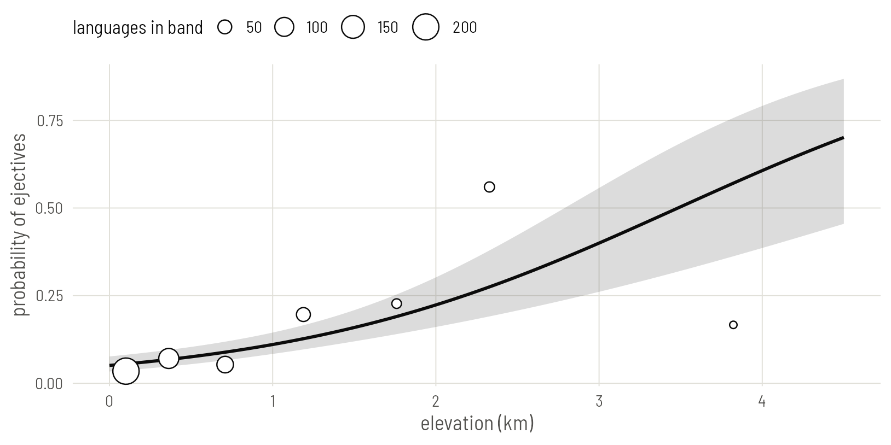
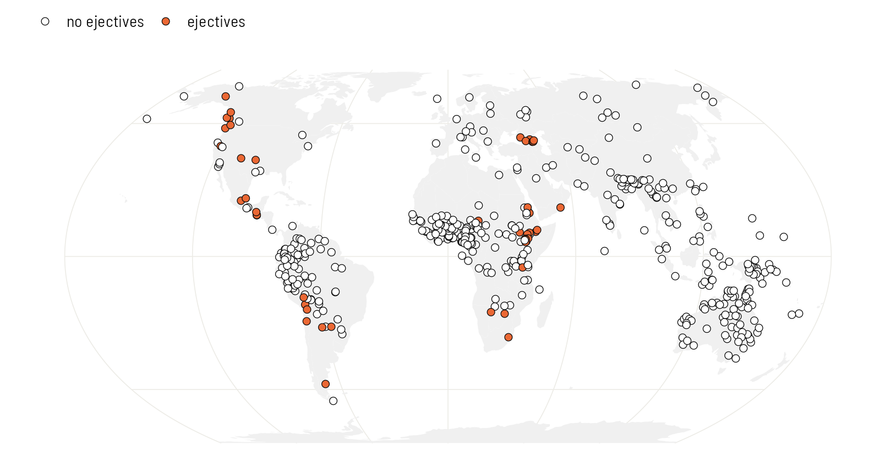
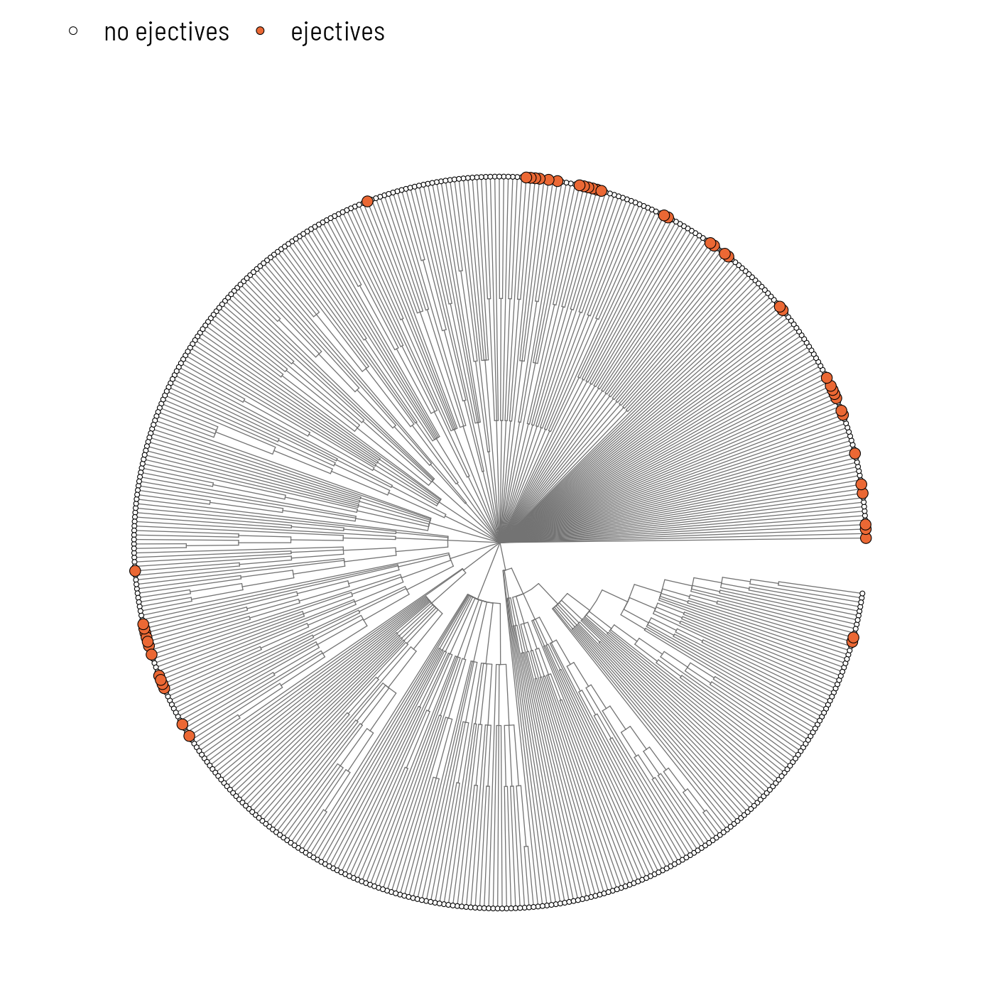
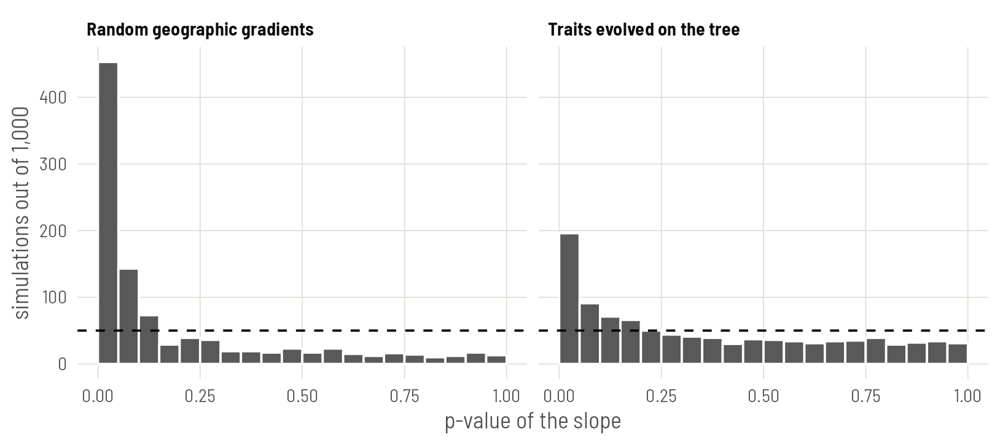

# Plate 1: Seeing the problem

Fit the regression everyone fits first, then show with a map, a tree and two small simulations why its standard error cannot be trusted.


## The data and the first model

Load the packages for this plate and read the two files every plate uses: one row per language, and a tree of the same languages.


``` r
library(ape)
library(phytools)
library(spdep)
library(sf)
library(rnaturalearth)
library(ggplot2)

base <- "https://rehan-muh.github.io/tutorials/data/"
d    <- read.csv(paste0(base, "languages.csv"))
tree <- read.tree(paste0(base, "glottolog_tree.nwk"))

d$elev_km <- d$elevation / 1000
d[c(1, 120, 250, 380, 500), c("name", "family", "elevation", "ejectives")]
```

``` output
               name         family elevation ejectives
1   West Circassian   Abkhaz-Adyge       235         1
120        Ginyanga Atlantic-Congo       299         0
250    Anindilyakwa    Gunwinyguan        75         0
380         Djangun   Pama-Nyungan       365         0
500          Ayoreo       Zamucoan       233         0
```

The question is Everett's: are languages spoken at altitude more likely to have ejectives? The obvious model is a logistic regression of `ejectives` on elevation in kilometres.


``` r
m0 <- glm(ejectives ~ elev_km, family = binomial, data = d)
round(summary(m0)$coefficients, 3)
```

``` output
            Estimate Std. Error z value Pr(>|z|)
(Intercept)   -2.924      0.222  -13.19        0
elev_km        0.839      0.147    5.72        0
```

Each kilometre of altitude multiplies the odds of having ejectives by about 2.3, and the slope sits 5.7 standard errors from zero. Taken at face value this is overwhelming evidence.

Draw the fitted line over the data. `predict()` returns the line and its standard error on the logit scale; `plogis()` turns both into probabilities. The circles are the observed share of languages with ejectives in seven bands of elevation.


``` r
grid <- data.frame(elev_km = seq(0, 4.5, by = 0.05))
pr   <- predict(m0, newdata = grid, se.fit = TRUE)
grid$p  <- plogis(pr$fit)
grid$lo <- plogis(pr$fit - 1.96 * pr$se.fit)
grid$hi <- plogis(pr$fit + 1.96 * pr$se.fit)

breaks <- c(0, 0.25, 0.5, 1, 1.5, 2, 3, 5)
d$band <- cut(d$elev_km, breaks, include.lowest = TRUE)
obs    <- aggregate(cbind(ejectives, elev_km) ~ band, data = d, FUN = mean)
obs$n  <- as.vector(table(d$band))

ggplot(grid, aes(elev_km, p)) +
  geom_ribbon(aes(ymin = lo, ymax = hi), alpha = 0.2) +
  geom_line(linewidth = 0.9) +
  geom_point(data = obs, aes(y = ejectives, size = n),
             shape = 21, fill = "white") +
  scale_size_area(max_size = 7, name = "languages in band") +
  labs(x = "elevation (km)", y = "probability of ejectives")
```


{width=814 height=407 alt="The naive regression line with its 95% band. Circles are observed shares of ejective languages in seven elevation bands, sized by the number of languages in the band. The band is narrow because the model believes it is looking at 500 independent languages."}

That standard error rests on one assumption: that the 500 languages are 500 independent observations. The rest of this plate checks it.

## Where the ejectives are

Put the languages on a map. `sf` turns the coordinates into points, `rnaturalearth` supplies the land, and `coord_sf()` draws both in the Equal Earth projection.


``` r
world <- ne_countries(scale = "small", returnclass = "sf")
pts   <- st_as_sf(d, coords = c("lon", "lat"), crs = 4326)

ggplot() +
  geom_sf(data = world, fill = "grey94", colour = NA) +
  geom_sf(data = pts, aes(fill = factor(ejectives)),
          shape = 21, size = 1.9, stroke = 0.3) +
  scale_fill_manual(values = c("0" = "white", "1" = "#EB6834"),
                    labels = c("no ejectives", "ejectives"), name = NULL) +
  coord_sf(crs = "+proj=eqearth")
```


{width=814 height=429 alt="The 500 languages of the sample. Languages with ejectives form a handful of regional clusters."}

The 50 languages with ejectives are not spread evenly over the high ground of the world. They sit in a few regions. Count the families they belong to:


``` r
ej <- subset(d, ejectives == 1)
head(sort(table(ej$family), decreasing = TRUE), 8)
```

``` output

     Afro-Asiatic             Mayan Nakh-Daghestanian      South Omotic 
               13                 3                 3                 3 
   Atlantic-Congo      Kiowa-Tanoan          Salishan      Ta-Ne-Omotic 
                2                 2                 2                 2 
```

``` r
length(unique(ej$family))
```

``` output
[1] 27
```

One family, Afro-Asiatic, supplies 13 of the 50. The rest come from 26 other families, yet on the map they still sit side by side: several unrelated families in the Caucasus, several in the Pacific Northwest, several in the Andes. Clustering inside a family points to inheritance. Clustering across families points to contact. This sample has both.

Now the tree. `ggtree` draws it as a fan, one wedge per family, and `%<+%` attaches the data so the tips can be coloured.


``` r
library(ggtree)

ggtree(tree, layout = "fan", open.angle = 8,
       linewidth = 0.2, colour = "grey45") %<+% d +
  geom_tippoint(aes(fill = factor(ejectives), size = factor(ejectives)),
                shape = 21, stroke = 0.25) +
  scale_fill_manual(values = c("0" = "white", "1" = "#EB6834"),
                    labels = c("no ejectives", "ejectives"), name = NULL) +
  scale_size_manual(values = c("0" = 0.9, "1" = 2.2), guide = "none")
```


{width=704 height=704 alt="The Glottolog tree of the sample, one tip per language. Tips with ejectives tend to sit next to other tips with ejectives. Families meet only at the centre: the tree claims no relationship between them."}

Both pictures say the same thing. If you know that one language has ejectives, you can guess that its sisters and its neighbours do too. Those languages are partly repeating each other, and a model that counts each as fresh evidence is counting too much.

## How often does a meaningless predictor pass?

A direct way to see the damage: invent predictors that cannot have anything to do with ejectives, and count how often the regression calls them significant. If the model is honest, that happens 5% of the time.

First, 1,000 made-up traits that evolve along the tree by Brownian motion. Each is inherited with random changes and nothing else. `fastBM()` simulates them all at once.


``` r
set.seed(1)
fake_phy <- fastBM(tree, nsim = 1000)[d$glottocode, ]

p_value <- function(x) {
  summary(glm(d$ejectives ~ x, family = binomial))$coefficients[2, 4]
}
p_phy   <- apply(fake_phy, 2, p_value)
mean(p_phy < 0.05)
```

``` output
[1] 0.196
```

Second, 1,000 made-up geographic gradients. Pick a random direction through the globe and score each language by how far along it the language lies. Latitude is one such gradient; these are 1,000 others.


``` r
rad <- pi / 180
xyz <- cbind(cos(d$lat * rad) * cos(d$lon * rad),
             cos(d$lat * rad) * sin(d$lon * rad),
             sin(d$lat * rad))

fake_sp <- xyz %*% t(matrix(rnorm(3000), ncol = 3))
p_sp    <- apply(fake_sp, 2, p_value)
mean(p_sp < 0.05)
```

``` output
[1] 0.453
```


``` r
sims <- data.frame(
  p    = c(p_phy, p_sp),
  kind = rep(c("Traits evolved on the tree", "Random geographic gradients"),
             each = 1000))

ggplot(sims, aes(p)) +
  geom_histogram(breaks = seq(0, 1, 0.05), fill = "grey35", colour = "white") +
  geom_hline(yintercept = 50, linetype = "dashed") +
  facet_wrap(~kind) +
  labs(x = "p-value of the slope", y = "simulations out of 1,000")
```


{width=814 height=363 alt="P-values from 1,000 regressions of ejectives on a predictor with no connection to them. An honest test would give a flat histogram, with 5% of p-values in the first bar (dashed line)."}

A trait that only follows the tree passes the 5% test 20% of the time, close to four times too often. A random gradient across the map passes 45% of the time, close to a coin flip. Elevation is exactly this kind of variable: it is shared by neighbours, and relatives tend to live near each other. So a small p-value for elevation tells us very little until the dependence between languages is in the model.

::: {.callout .assume}
These simulations hold the real ejective data fixed and randomise the predictor. That is the right comparison for one question only: could a predictor with this much spatial or genealogical structure pass by accident? It can, easily.
:::

## Measuring spatial dependence: Moran's I

The simulations show the problem exists. Two standard statistics measure how much of it is left in a model's residuals.

Moran's I is a correlation between each language's value and the average of its neighbours. It needs a definition of "neighbour". Here each language is linked to its five nearest, by great-circle distance, and links are made mutual.


``` r
coords <- as.matrix(d[, c("lon", "lat")])
nb <- knn2nb(knearneigh(coords, k = 5, longlat = TRUE))
nb <- make.sym.nb(nb)
lw <- nb2listw(nb, style = "W")

moran.mc(residuals(m0, type = "pearson"), lw, nsim = 999)
```

``` output

	Monte-Carlo simulation of Moran I

data:  residuals(m0, type = "pearson") 
weights: lw  
number of simulations + 1: 1000 

statistic = 0.4, observed rank = 1000, p-value = 0.001
alternative hypothesis: greater
```


Under independence I is close to zero. The residuals of the elevation model have I = 0.44, larger than every one of 999 random reshufflings of the residuals over the map. What the model failed to explain about one language, it failed to explain about its neighbours in the same direction.

## Measuring phylogenetic signal

The genealogical counterpart asks how much of a variable's variation follows the tree. Pagel's λ runs from 0 (relatives are no more alike than strangers) to 1 (as alike as Brownian motion along the tree predicts). `phylosig()` estimates it for a named vector of values.


``` r
res <- setNames(residuals(m0, type = "pearson"), d$glottocode)
phylosig(tree, res, method = "lambda", test = TRUE)
```

``` output

Phylogenetic signal lambda : 1.08325 
logL(lambda) : -605.72 
LR(lambda=0) : 160.594 
P-value (based on LR test) : 8.39177e-37 
```

The estimate is at its ceiling. (The ceiling depends on the shape of the tree and can sit a little above 1, as it does here.) Relatives are at least as alike in their residuals as the tree predicts, and the test against λ = 0 leaves no doubt. The same call works for any continuous variable. Consonant inventory size, on the log scale, is a useful second example because it will come back on Plate 8:


``` r
log_cons <- setNames(log(d$n_consonants), d$glottocode)
phylosig(tree, log_cons, method = "lambda", test = TRUE)
```

``` output

Phylogenetic signal lambda : 1.08325 
logL(lambda) : -100.842 
LR(lambda=0) : 219.301 
P-value (based on LR test) : 1.28492e-49 
```

::: {.callout .pitfall}
λ and Moran's I are built for continuous values. Applied to the residuals of a logistic regression they are a serviceable alarm, not a measurement. For a binary feature the dependence is better estimated inside the model itself, which is what the next plates do.
:::

::: {.callout .yours}
You need three things: a data frame with one row per language, a `phylo` object whose tip labels match a column of that data frame, and coordinates. Check the match before anything else with `setdiff(tree$tip.label, d$glottocode)`; it should return nothing in either direction.
:::

## What to carry forward

- The naive slope is 0.84 per kilometre with a standard error of 0.15. Keep these two numbers in mind; every later plate re-estimates them.
- Ejectives cluster in families and in regions, and the residuals of the naive model inherit both kinds of clustering.
- With data like these, predictors that mean nothing pass a 5% test 20% to 45% of the time.

There are two ways forward and they are not rivals. One models who is related to whom ([Plate 2](../02-phylogeny/)). The other models who lives near whom ([Plates 3](../03-space-surface/) and [4](../04-space-neighbours/)). [Plate 5](../05-joint/) puts them in one model.
