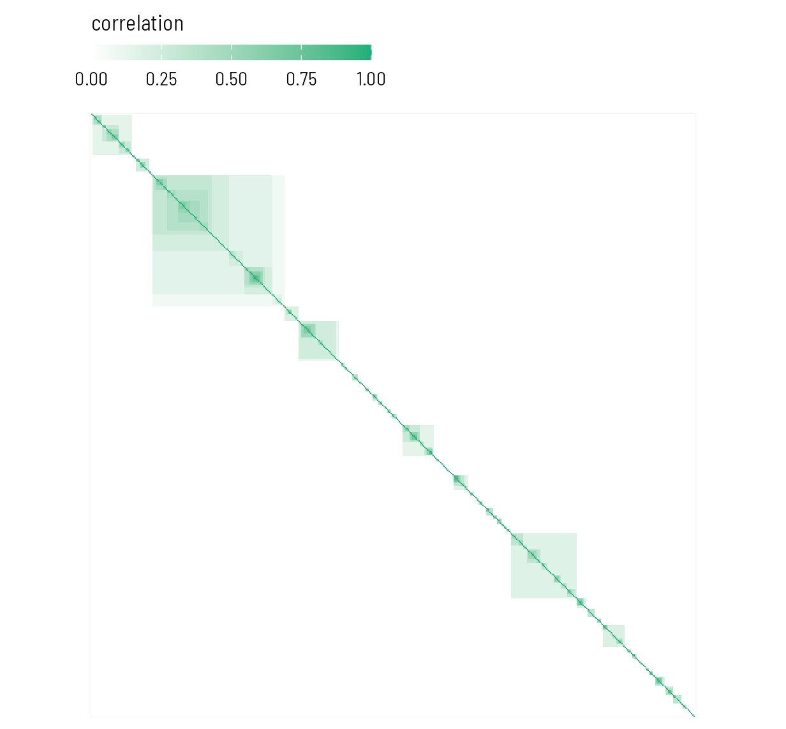
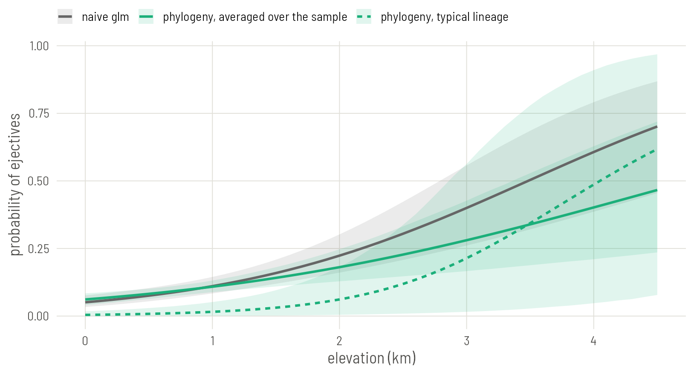
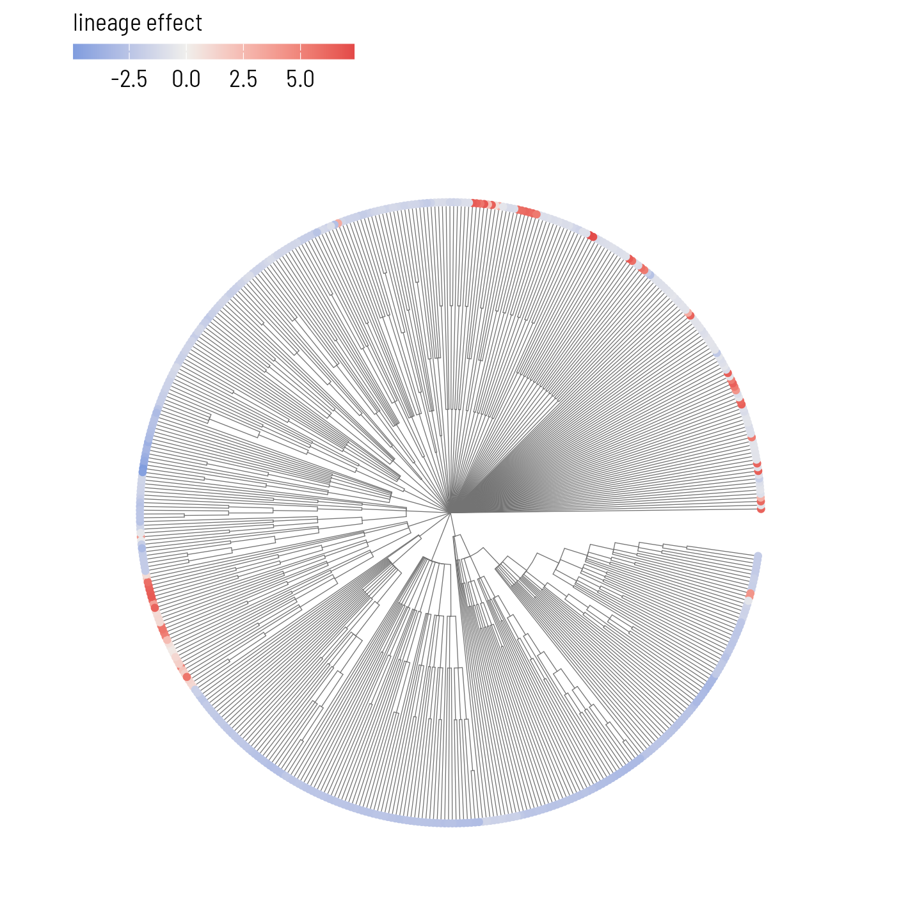

# Plate 2: Phylogeny as a covariance matrix

Turn the tree into a matrix that says how much history each pair of languages shares, and hand that matrix to brms.


## Set up

Read the data as on Plate 1 and refit the naive model, so its slope is at hand for comparison.


``` r
library(ape)
library(brms)
library(ggplot2)

base <- "https://rehan-muh.github.io/tutorials/data/"
d    <- read.csv(paste0(base, "languages.csv"))
tree <- read.tree(paste0(base, "glottolog_tree.nwk"))
d$elev_km <- d$elevation / 1000

m0 <- glm(ejectives ~ elev_km, family = binomial, data = d)
```

Two settings make brms pleasant to work with. The first runs the four chains in parallel and uses the `cmdstanr` backend. The second is a folder for saved fits: with `file =` in the model call, brms stores the fitted model there and reloads it on the next run, so the script never fits the same model twice.


``` r
options(mc.cores = 4, brms.backend = "cmdstanr")
dir.create("fits", showWarnings = FALSE)
```

## From a tree to a matrix

A regression cannot use a tree directly. What it can use is a matrix with one row and one column per language, where each cell says how similar two languages are expected to be. `vcv()` builds that matrix from the tree.


``` r
A <- vcv(tree, corr = TRUE)
dim(A)
```

``` output
[1] 500 500
```

``` r
show <- c("Tigrinya", "Tigre", "Harari", "Eastern Oromo", "Zulu")
i <- d$glottocode[match(show, d$name)]
round(A[i, i], 2) |> `dimnames<-`(list(show, show))
```

``` output
              Tigrinya Tigre Harari Eastern Oromo Zulu
Tigrinya          1.00  0.43   0.43          0.14    0
Tigre             0.43  1.00   0.43          0.14    0
Harari            0.43  0.43   1.00          0.14    0
Eastern Oromo     0.14  0.14   0.14          1.00    0
Zulu              0.00  0.00   0.00          0.00    1
```

The rule behind the numbers is Brownian motion. Imagine a trait drifting at random along the branches. Two languages share every change that happened on the path they have in common and differ by what happened after they split. Their expected correlation is the share of the tree's height they travelled together.

In this tree every level of the Glottolog classification is one step, so that share is simply the fraction of classification levels two languages have in common. Tigrinya, Tigre and Harari are all Ethiosemitic: they share every level from Afro-Asiatic down to Ethiosemitic, which comes to 0.43 of the tree's height. Oromo is Cushitic. It shares with them the family level, Afro-Asiatic, and nothing below it: 0.14. Zulu is in another family and shares nothing.


``` r
long <- as.data.frame(as.table(A))
names(long) <- c("row", "col", "r")

ggplot(long, aes(col, factor(row, levels = rev(rownames(A))), fill = r)) +
  geom_raster() +
  scale_fill_gradient(low = "white", high = "#1BAF7A", name = "correlation") +
  coord_fixed() +
  theme(axis.text = element_blank(), axis.title = element_blank(),
        panel.grid = element_blank())
```


{width=616 height=572 alt="The phylogenetic correlation matrix for all 500 languages, in tree order. Each dark square on the diagonal is a family; shading inside a square is subgrouping. Everything outside the squares is zero."}

::: {.callout .assume}
Using this matrix asserts three things: the classification is right, the branch lengths mean something, and features change gradually along branches at a steady rate. For a Glottolog tree the second is a convention, not a measurement: nobody believes each level of a classification stands for the same amount of time. The matrix still does the main job, which is to encode who is nested inside what. If you have a dated phylogeny for your families, use it; nothing else on this plate changes.
:::

## First rung: family as a random intercept

Before using the whole matrix, fit the model most typologists reach for first: one random intercept per family.

Priors first. The slope is in log-odds per kilometre, and a normal(0, 1) prior says a kilometre is unlikely to multiply the odds by more than about seven either way. The standard deviation of the family intercepts gets an exponential(1) prior, which puts 95% of its weight below 3. On the logit scale that is already a wide spread: families two standard deviations apart would differ in odds by a factor of several thousand.


``` r
priors <- prior(normal(0, 1), class = b) +
          prior(exponential(1), class = sd)

m_fam <- brm(ejectives ~ elev_km + (1 | family),
             data = d, family = bernoulli(), prior = priors,
             seed = 1, file = "fits/m_fam")
```

::: {.callout .runtime}
Each new brms model compiles for about a minute before it samples. Sampling itself takes a few seconds here. With `file =`, the second run of this line returns at once.
:::


``` r
summary(m_fam)
```

``` output
 Family: bernoulli 
  Links: mu = logit 
Formula: ejectives ~ elev_km + (1 | family) 
   Data: d (Number of observations: 500) 
  Draws: 4 chains, each with iter = 2000; warmup = 1000; thin = 1;
         total post-warmup draws = 4000

Multilevel Hyperparameters:
~family (Number of levels: 110) 
              Estimate Est.Error l-95% CI u-95% CI Rhat Bulk_ESS Tail_ESS
sd(Intercept)     4.24      1.03     2.61     6.64 1.00     1466     2355

Regression Coefficients:
          Estimate Est.Error l-95% CI u-95% CI Rhat Bulk_ESS Tail_ESS
Intercept    -4.97      0.96    -7.09    -3.38 1.00     1488     1907
elev_km       1.29      0.31     0.70     1.91 1.00     4464     3202

Draws were sampled using sample(hmc). For each parameter, Bulk_ESS
and Tail_ESS are effective sample size measures, and Rhat is the potential
scale reduction factor on split chains (at convergence, Rhat = 1).
```

Read three things. `Rhat` is 1.00 everywhere and the effective sample sizes are in the thousands, so the chains agree. `sd(Intercept)` is large: families differ a great deal in their baseline odds of having ejectives. And the slope for `elev_km` has moved, with an interval about twice as wide as the naive one.

A family intercept treats every pair of languages in a family as equally close and every family as unrelated to every other. The second half is what our tree says too. The first half throws away the subgrouping: Tigrinya is no closer to Tigre than to Oromo.

## The phylogenetic model

The phylogenetic model gives every language its own intercept and tells brms that these intercepts are correlated according to `A`. The grouping term changes from `(1 | family)` to `(1 | gr(glottocode, cov = A))`, and the matrix travels in `data2`.


``` r
m_phy <- brm(ejectives ~ elev_km + (1 | gr(glottocode, cov = A)),
             data = d, data2 = list(A = A),
             family = bernoulli(), prior = priors,
             seed = 1, file = "fits/m_phy")

summary(m_phy)
```

``` output
 Family: bernoulli 
  Links: mu = logit 
Formula: ejectives ~ elev_km + (1 | gr(glottocode, cov = A)) 
   Data: d (Number of observations: 500) 
  Draws: 4 chains, each with iter = 2000; warmup = 1000; thin = 1;
         total post-warmup draws = 4000

Multilevel Hyperparameters:
~glottocode (Number of levels: 500) 
              Estimate Est.Error l-95% CI u-95% CI Rhat Bulk_ESS Tail_ESS
sd(Intercept)     3.97      1.04     2.32     6.36 1.00     1353     2070

Regression Coefficients:
          Estimate Est.Error l-95% CI u-95% CI Rhat Bulk_ESS Tail_ESS
Intercept    -6.06      1.30    -9.07    -4.04 1.00     1593     1773
elev_km       1.49      0.42     0.73     2.39 1.00     2996     2703

Draws were sampled using sample(hmc). For each parameter, Bulk_ESS
and Tail_ESS are effective sample size measures, and Rhat is the potential
scale reduction factor on split chains (at convergence, Rhat = 1).
```

That is the whole model. In symbols, for language $i$:

$$\text{logit}\,\Pr(\text{ejectives}_i) = \alpha + \beta\,\text{elevation}_i + u_i, \qquad u \sim \mathcal{N}(0,\ \sigma^2 A)$$

The vector $u$ holds one value per language. Close relatives get similar values because `A` says so, and $\sigma$, reported as `sd(Intercept)`, says how strong the inherited tendencies are.

::: {.callout .yours}
The row names of `A` must be the values of the grouping column, here `glottocode`. If your tree has languages your data lacks, prune it first with `keep.tip(tree, d$glottocode)`. If you have several observations per language, keep this term and add a plain `(1 | language)` beside it for language-specific variation that the tree does not explain.
:::

## Reading the result

### The slope

Put the three slopes side by side.


``` r
naive  <- unname(c(coef(m0)[2], sqrt(vcov(m0)[2, 2]), confint.default(m0)[2, ]))
slopes <- rbind("naive glm"        = naive,
                "family intercept" = fixef(m_fam)["elev_km", ],
                "phylogeny"        = fixef(m_phy)["elev_km", ])
round(slopes, 2)
```

``` output
                 Estimate Est.Error Q2.5 Q97.5
naive glm            0.84      0.15 0.55  1.13
family intercept     1.29      0.31 0.70  1.91
phylogeny            1.49      0.42 0.73  2.39
```

Two things changed and they should be kept apart.

The uncertainty grew. The intervals are two to three times as wide as the naive one, which is the honest price of admitting that related languages are not separate witnesses.

The estimate also grew, and that is not evidence that the effect is stronger. In a logistic model with random effects, the slope describes what a kilometre does *within* a lineage, holding its inherited tendency fixed. The naive slope averages over lineages. The first is always the larger number when lineages differ a lot. A standard approximation converts one to the other: divide by $\sqrt{1 + 0.346\,\sigma^2}$.


``` r
draws <- as_draws_df(m_phy)
averaged <- draws$b_elev_km / sqrt(1 + 0.346 * draws$sd_glottocode__Intercept^2)
round(quantile(averaged, c(0.025, 0.5, 0.975)), 2)
```

``` output
 2.5%   50% 97.5% 
 0.29  0.59  0.91 
```

On the scale the naive model works in, the phylogenetic estimate is smaller than 0.84 and its interval is wider. The association survives, with less certainty than the first regression claimed.

### The regression line

Numbers in a table hide how different these models are. Draw the lines.

A model with lineage effects has two regression lines, and they answer different questions. One is the line for **a typical lineage**, whose inherited tendency is zero: what elevation does within a lineage. The other is the line **averaged over the sample**: keep every language's own lineage effect, move all 500 languages to the same elevation, and ask what share of them would have ejectives. Only the second is comparable with the naive line.

Both come from the posterior draws. `posterior_linpred()` returns the linear predictor of every language, lineage effect included, once per draw. Subtracting each language's own elevation term moves it to sea level; adding the slope times a new elevation moves the whole sample there.


``` r
x <- seq(0, 4.5, by = 0.1)
pr <- predict(m0, newdata = data.frame(elev_km = x), se.fit = TRUE)
naive <- data.frame(elev_km = x, model = "naive glm", p = plogis(pr$fit),
                    lo = plogis(pr$fit - 1.96 * pr$se.fit),
                    hi = plogis(pr$fit + 1.96 * pr$se.fit))

band <- function(p, label) {
  data.frame(elev_km = x, model = label, p = colMeans(p),
             lo = apply(p, 2, quantile, 0.025),
             hi = apply(p, 2, quantile, 0.975))
}
b      <- draws$b_elev_km
eta    <- posterior_linpred(m_phy)       # draws by languages, logit scale
at_sea <- eta - outer(b, d$elev_km)      # every language moved to 0 km

typical  <- plogis(draws$b_Intercept + outer(b, x))
averaged <- sapply(x, function(xi) rowMeans(plogis(at_sea + b * xi)))

lines <- rbind(naive,
               band(averaged, "phylogeny, averaged over the sample"),
               band(typical, "phylogeny, typical lineage"))

ggplot(lines, aes(elev_km, p, colour = model, fill = model, linetype = model)) +
  geom_ribbon(aes(ymin = lo, ymax = hi), alpha = 0.13, colour = NA) +
  geom_line(linewidth = 0.9) +
  scale_colour_manual(values = c("grey40", "#1BAF7A", "#1BAF7A"),
                      aesthetics = c("colour", "fill"), name = NULL) +
  scale_linetype_manual(values = c("solid", "solid", "22"), name = NULL) +
  labs(x = "elevation (km)", y = "probability of ejectives")
```


{width=814 height=440 alt="Three regression lines with 95% bands: the naive fit (grey), the phylogenetic model averaged over the sample (solid green), and the phylogenetic model for a typical lineage (dashed green)."}

Read the solid green line against the grey one. In the lowlands, where most of the languages are, the two agree. Above two kilometres they part: the phylogenetic line climbs more slowly and its band fans out. Highland languages with ejectives come from a small number of lineages, so there is much less independent evidence up there than the naive model believed.

The dashed line is the same model seen from inside one lineage. A typical lineage has almost no chance of ejectives at sea level, and the climb with altitude is steep. This is the slope the model reports, and the reason it is larger than the naive one.

### Phylogenetic signal

How much of the variation in ejectives follows the tree? On the logit scale each language carries a fixed residual variance of $\pi^2/3$, so the share attributable to phylogeny is $\sigma^2 / (\sigma^2 + \pi^2/3)$. This is the model-based counterpart of Pagel's λ from Plate 1, and it agrees with it: most of the variation in who has ejectives runs along the tree.


``` r
signal <- draws$sd_glottocode__Intercept^2 /
          (draws$sd_glottocode__Intercept^2 + pi^2 / 3)
round(quantile(signal, c(0.025, 0.5, 0.975)), 2)
```

``` output
 2.5%   50% 97.5% 
 0.62  0.82  0.92 
```

### Where the model put the lineage effects

`ranef()` returns the estimated $u_i$ for every language. Painted onto the tree, they show which lineages the model treats as inclined towards ejectives regardless of altitude.


``` r
library(ggtree)

u <- ranef(m_phy)$glottocode[, "Estimate", "Intercept"]
effects <- data.frame(glottocode = names(u), effect = u)

ggtree(tree, layout = "fan", open.angle = 8,
       linewidth = 0.2, colour = "grey45") %<+% effects +
  geom_tippoint(aes(colour = effect), size = 1.3) +
  scale_colour_gradient2(low = "#2A78D6", mid = "#F0EFEC", high = "#E34948",
                         name = "lineage effect")
```


{width=704 height=704 alt="Posterior mean of each language's phylogenetic effect, on the logit scale. Whole clades lean the same way, which is what a phylogenetic random effect is for."}

## What to carry forward

- A phylogenetic regression in brms is a random intercept with a known correlation matrix: `(1 | gr(glottocode, cov = A))` with `A <- vcv(tree, corr = TRUE)`.
- The family intercept is the coarse version of the same idea. Here the two tell the same story; the phylogenetic model, which also has to learn from the subgroups, is the less certain of the two.
- Compare intervals, not raw slopes, between a model with random effects and one without.

The same languages that share ancestors also share regions. [Plate 3](../03-space-surface/) leaves the tree aside and models location.
