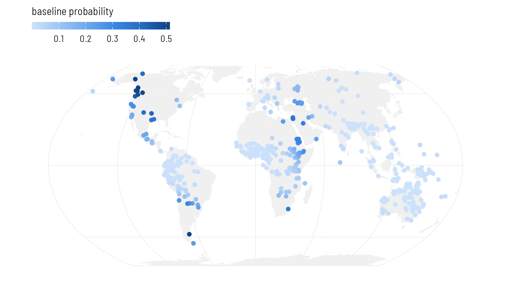

# Plate 3: Space as a smooth surface

Let a Gaussian process draw a smooth surface over the map, so that nearby languages are pulled towards the same baseline.


## Set up


``` r
library(ape)
library(brms)
library(sf)
library(spdep)
library(rnaturalearth)
library(ggplot2)

base <- "https://rehan-muh.github.io/tutorials/data/"
d    <- read.csv(paste0(base, "languages.csv"))
d$elev_km <- d$elevation / 1000

options(mc.cores = 4, brms.backend = "cmdstanr")
dir.create("fits", showWarnings = FALSE)
```

## The idea

Plate 2 said: languages are alike to the degree that they share ancestry. This plate says: languages are alike to the degree that they are close on the ground, whoever their ancestors were.

A Gaussian process (GP) turns that sentence into a model. It adds to the regression an unknown surface $f$ over the map,

$$\text{logit}\,\Pr(\text{ejectives}_i) = \alpha + \beta\,\text{elevation}_i + f(\text{location}_i),$$

and assumes only that $f$ is smooth: its values at two places are correlated, and the correlation fades with the distance between them. Two numbers govern it. The **length-scale** is how far you must travel before the surface is free to change. The **standard deviation** is how far the surface strays from zero. Both are estimated.

Where the model sees a cluster of ejective languages, it can raise the surface there and explain the cluster by location. Elevation then has to earn its slope from what the surface leaves over: differences between neighbours at different heights.

## Coordinates the model can measure with

A GP needs distances, and longitude and latitude are angles. A degree of longitude is 111 km at the equator and 56 km at 60° north. So first project the points to a flat map on which distances are roughly right. Equal Earth is a reasonable choice for a world sample. The units are converted to thousands of kilometres to keep the numbers small.


``` r
pts <- st_as_sf(d, coords = c("lon", "lat"), crs = 4326)
xy  <- st_coordinates(st_transform(pts, "+proj=eqearth")) / 1e6
d$x <- xy[, 1]
d$y <- xy[, 2]
```

::: {.callout .assume}
A flat map cannot keep every distance true, and this one is cut at the 180th meridian, so languages on either side of the Bering Strait look far apart. For this sample almost nothing depends on that. [Plate 6](../06-inla/) and [Plate 7](../07-mgcv/) fit surfaces on the sphere itself.
:::

## Fitting it

An exact GP over 500 points is slow, because the model must work with a 500 by 500 matrix at every step. brms offers an approximation that builds the surface from a fixed set of smooth waves, known as a Hilbert-space GP. You ask for it by giving `gp()` the argument `k`, the number of waves in each direction.


``` r
priors <- prior(normal(0, 1), class = b) +
          prior(exponential(1), class = sdgp)

m_gp <- brm(ejectives ~ elev_km + gp(x, y, k = 20, c = 5/4),
            data = d, family = bernoulli(), prior = priors,
            control = list(adapt_delta = 0.95),
            seed = 1, file = "fits/m_gp")

summary(m_gp)
```

``` output
 Family: bernoulli 
  Links: mu = logit 
Formula: ejectives ~ elev_km + gp(x, y, k = 20, c = 5/4) 
   Data: d (Number of observations: 500) 
  Draws: 4 chains, each with iter = 2000; warmup = 1000; thin = 1;
         total post-warmup draws = 4000

Gaussian Process Hyperparameters:
             Estimate Est.Error l-95% CI u-95% CI Rhat Bulk_ESS Tail_ESS
sdgp(gpxy)       4.52      1.32     2.51     7.65 1.00     2095     2814
lscale(gpxy)     0.05      0.02     0.02     0.10 1.00     2517     2528

Regression Coefficients:
          Estimate Est.Error l-95% CI u-95% CI Rhat Bulk_ESS Tail_ESS
Intercept    -4.55      1.21    -7.21    -2.38 1.00     2474     1826
elev_km       1.13      0.27     0.65     1.69 1.00     5418     2822

Draws were sampled using sample(hmc). For each parameter, Bulk_ESS
and Tail_ESS are effective sample size measures, and Rhat is the potential
scale reduction factor on split chains (at convergence, Rhat = 1).
```

The pieces of the call:

- `gp(x, y)` asks for one surface over both coordinates, with a single length-scale.
- `k = 20` uses 20 waves in each direction, 400 in all. More waves can follow a wigglier surface and cost more time.
- `c = 5/4` extends the area the waves cover a little beyond the data, which keeps the approximation accurate near the edges. It is the usual value.
- `prior(exponential(1), class = sdgp)` is the same prior as on Plate 2, now on the standard deviation of the surface.
- `adapt_delta = 0.95` makes the sampler take smaller steps. GPs often need it; if brms warns about divergent transitions, raise it towards 0.99.

In the output, `sdgp` is the standard deviation of the surface and `lscale` its length-scale. brms rescales the coordinates so that the largest distance in the data is 1, so `lscale` is a fraction of that distance.


``` r
max_dist <- max(dist(xy)) * 1000        # in km
ls <- posterior_summary(m_gp, variable = "lscale_gpxy")
round(ls[, c("Estimate", "Q2.5", "Q97.5")] * max_dist)
```

``` output
Estimate     Q2.5    Q97.5 
    1602      732     3010 
```

The surface changes over distances of that order, in kilometres: regions, not continents.

## Was `k` large enough?

`k` is a setting, not a result, and too small a `k` silently flattens the surface. The shorter the length-scale, the more waves are needed to draw it. A quick rule: the estimated `lscale` should stay above `c / k`. Here `c / k` is 0.062 and the estimate is 0.05, a little under. That is a warning, not a verdict.

The direct check is to fit again with other values of `k` and see whether anything you care about moves. Fit a coarser surface with 12 waves a side and a finer one with 28. The finer one has 784 waves and takes about five minutes; skip it if you are following along for the first time.


``` r
m_gp12 <- brm(ejectives ~ elev_km + gp(x, y, k = 12, c = 5/4),
              data = d, family = bernoulli(), prior = priors,
              control = list(adapt_delta = 0.95),
              seed = 1, file = "fits/m_gp12")
m_gp28 <- brm(ejectives ~ elev_km + gp(x, y, k = 28, c = 5/4),
              data = d, family = bernoulli(), prior = priors,
              control = list(adapt_delta = 0.95),
              seed = 1, file = "fits/m_gp28")

check <- function(m) {
  c(fixef(m)["elev_km", c("Estimate", "Est.Error")],
    lscale = posterior_summary(m, variable = "lscale_gpxy")[, "Estimate"])
}
round(rbind("k = 12" = check(m_gp12),
            "k = 20" = check(m_gp),
            "k = 28" = check(m_gp28)), 2)
```

``` output
       Estimate Est.Error lscale
k = 12     0.90      0.22   0.08
k = 20     1.13      0.27   0.05
k = 28     1.21      0.31   0.04
```

Read down the columns. From 12 to 20 waves the slope moves by almost a full standard error: 12 was too few, and nothing in that fit's own output would have told you. From 20 to 28 it moves by about a quarter of a standard error. The length-scale is still creeping down, because the ejective clusters are small and tight, and a surface that follows them closely needs a great many waves.

So `k = 20` is adequate for the slope, which is what this series is after, and the rest of the plates use it. If the surface itself were your result, you would want a finer one, or one of the methods on Plates 6 and 7, which handle short ranges with less effort. Either way, the comparison is worth a line in a methods section: say which `k` you used and that the result held at a larger one.

::: {.callout .pitfall}
If brms prints warnings about divergent transitions for a GP, the surface is usually being asked to do something the data do not pin down. Raise `adapt_delta` towards 0.99 first. If they persist, tighten the prior on `sdgp`.
:::

## What the surface looks like

`fitted()` with elevation set to zero returns the baseline the model assigns to each location: intercept plus surface, with altitude taken out. Plotted on the map, it is the model's picture of where ejectives are at home.


``` r
sea_level <- transform(d, elev_km = 0)
d$baseline <- fitted(m_gp, newdata = sea_level)[, "Estimate"]

world <- ne_countries(scale = "small", returnclass = "sf")
pts$baseline <- d$baseline

ggplot() +
  geom_sf(data = world, fill = "grey94", colour = NA) +
  geom_sf(data = pts[order(pts$baseline), ], aes(colour = baseline),
          size = 1.6) +
  scale_colour_viridis_c(name = "baseline probability") +
  coord_sf(crs = "+proj=eqearth")
```


{width=814 height=451 alt="The spatial baseline at each language's location: the probability of ejectives the model expects there at sea level. The surface rises over the same regions where the map on Plate 1 showed clusters."}

## Did it work?

On Plate 1 the residuals of the naive model had a Moran's I of 0.44. Run the same test on the residuals of this model, with the same neighbours.


``` r
nb <- knn2nb(knearneigh(as.matrix(d[, c("lon", "lat")]), k = 5, longlat = TRUE))
lw <- nb2listw(make.sym.nb(nb), style = "W")

p   <- fitted(m_gp)[, "Estimate"]
res <- (d$ejectives - p) / sqrt(p * (1 - p))        # Pearson residuals
after <- moran.mc(res, lw, nsim = 999)
after
```

``` output

	Monte-Carlo simulation of Moran I

data:  res 
weights: lw  
number of simulations + 1: 1000 

statistic = 0.06, observed rank = 990, p-value = 0.01
alternative hypothesis: greater
```

Moran's I has dropped from 0.44 to 0.06. A trace of spatial pattern is still detectable, but nearly all of it has been absorbed by the surface: what is left unexplained about one language now says very little about what is left unexplained about its neighbours.

And the slope:


``` r
round(fixef(m_gp)["elev_km", ], 2)
```

``` output
 Estimate Est.Error      Q2.5     Q97.5 
     1.13      0.27      0.65      1.69 
```

As on Plate 2, compare the interval with the naive one (0.55 to 1.13), not the raw estimate; the note there about slopes in models with latent effects applies here too.

## The regression line

Draw the model's regression line beside the naive one. As on Plate 2, the fair comparison is the line averaged over the sample: keep each language's own spatial effect, move all 500 languages to the same elevation, and take the share expected to have ejectives.


``` r
m0 <- glm(ejectives ~ elev_km, family = binomial, data = d)
x  <- seq(0, 4.5, by = 0.1)
pr <- predict(m0, newdata = data.frame(elev_km = x), se.fit = TRUE)
naive <- data.frame(elev_km = x, model = "naive glm", p = plogis(pr$fit),
                    lo = plogis(pr$fit - 1.96 * pr$se.fit),
                    hi = plogis(pr$fit + 1.96 * pr$se.fit))

b      <- as_draws_df(m_gp)$b_elev_km
eta    <- posterior_linpred(m_gp)        # draws by languages, logit scale
at_sea <- eta - outer(b, d$elev_km)      # every language moved to 0 km
p      <- sapply(x, function(xi) rowMeans(plogis(at_sea + b * xi)))
model  <- data.frame(elev_km = x, model = "spatial surface (GP)",
                     p  = colMeans(p),
                     lo = apply(p, 2, quantile, 0.025),
                     hi = apply(p, 2, quantile, 0.975))

ggplot(rbind(naive, model), aes(elev_km, p, colour = model, fill = model)) +
  geom_ribbon(aes(ymin = lo, ymax = hi), alpha = 0.15, colour = NA) +
  geom_line(linewidth = 0.9) +
  scale_colour_manual(values = c("grey40", "#2A78D6"),
                      aesthetics = c("colour", "fill"), name = NULL) +
  labs(x = "elevation (km)", y = "probability of ejectives")
```


{width=814 height=418 alt="The naive regression line (grey) and the line from the spatial model averaged over the sample (blue), with 95% bands. The two agree in the lowlands. At altitude the spatial model's line is lower and its band is wider, because highland languages with ejectives sit in a few neighbourhoods."}

## Variations

**A rougher surface.** The default kernel produces very smooth surfaces. Contact zones can have sharper edges than that. `gp(x, y, k = 20, c = 5/4, cov = "matern32")` uses a Matérn kernel, which allows them. It needs brms 2.23 or later.

**A spline in place of a GP.** `s(lat, lon, bs = "sos")` in the same formula fits a spline on the sphere, with no projection. It samples faster and answers the same question; [Plate 7](../07-mgcv/) covers it in its home package.

::: {.callout .yours}
For a sample from one region, project to a local coordinate system (a UTM zone, or an equal-area projection centred on your area) and the flat-map caveat mostly disappears. If several languages share one location, the GP treats them as the same place, which is what you want.
:::

## What to carry forward

- A spatial regression in brms is one extra term: `gp(x, y, k = , c = 5/4)` on projected coordinates.
- Check `k` against the estimated length-scale, and check the residuals with Moran's I.
- The surface is a description of where the feature clusters. It does not say why: contact, shared environment and unrecorded ancestry all look the same to it.

A GP treats space as continuous. [Plate 4](../04-space-neighbours/) takes the other view, where space is a network and each language answers to its neighbours.
