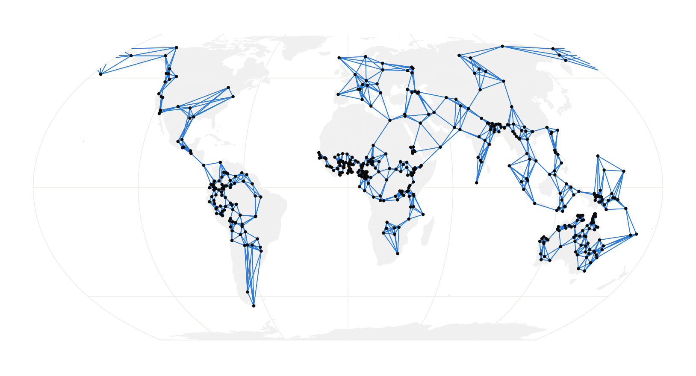
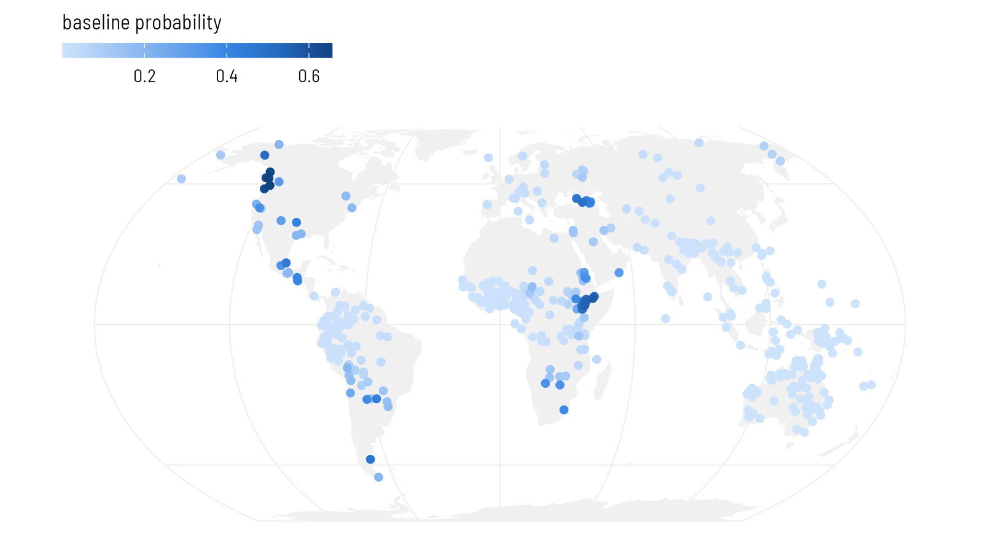
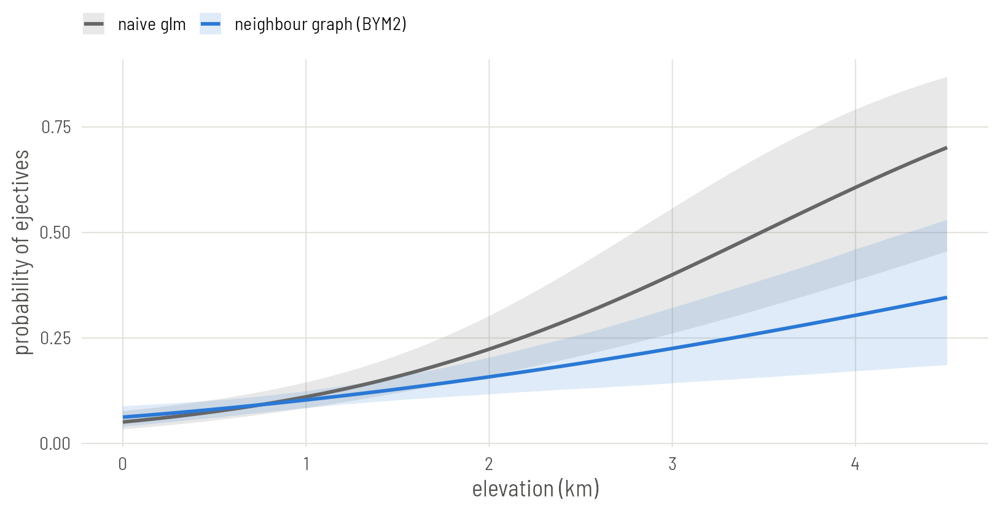

# Plate 4: Space as a network of neighbours

Link each language to the languages around it and let every language lean towards the average of its neighbours.


## Set up


``` r
library(brms)
library(spdep)
library(sf)
library(rnaturalearth)
library(ggplot2)

base <- "https://rehan-muh.github.io/tutorials/data/"
d    <- read.csv(paste0(base, "languages.csv"))
d$elev_km <- d$elevation / 1000

options(mc.cores = 4, brms.backend = "cmdstanr")
dir.create("fits", showWarnings = FALSE)
```

## The idea

The Gaussian process on Plate 3 measured distances. The models on this plate only ask who is next to whom. You draw a graph with a link between every pair of neighbouring languages, and the model gives each language a spatial effect that is expected to equal the average of its neighbours' effects:

$$\phi_i \mid \phi_{\text{others}} \sim \mathcal{N}\!\left(\frac{1}{n_i}\sum_{j \sim i} \phi_j,\ \frac{\sigma^2}{n_i}\right)$$

Here $j \sim i$ runs over the $n_i$ neighbours of language $i$. This is the intrinsic conditional autoregressive model, ICAR. It was designed for areas such as counties, which have borders and therefore natural neighbours. Languages recorded as points have no borders, so the graph is yours to define, and that definition is the main modelling decision on this plate.

## Building the graph

A simple, defensible rule: link every language to its five nearest languages by great-circle distance, and make every link mutual.


``` r
coords <- as.matrix(d[, c("lon", "lat")])
nb <- knn2nb(knearneigh(coords, k = 5, longlat = TRUE))
nb <- make.sym.nb(nb)

summary(card(nb))        # number of neighbours per language
```

``` output
   Min. 1st Qu.  Median    Mean 3rd Qu.    Max. 
   5.00    5.00    6.00    6.43    7.00   10.00 
```

``` r
n.comp.nb(nb)$nc         # number of separate pieces
```

``` output
[1] 1
```

After the links are made mutual, languages have between 5 and 10 neighbours. The second number matters more: the graph is in one piece. The models below need that. If `n.comp.nb()` reports more than one piece, raise `k` until it reports one.

Always look at the graph.


``` r
world <- ne_countries(scale = "small", returnclass = "sf")
pts   <- st_as_sf(d, coords = c("lon", "lat"), crs = 4326)
links <- nb2lines(nb, coords = st_geometry(pts))
# split the links that cross the 180th meridian, so they are drawn the short way
links <- st_wrap_dateline(links, options = c("WRAPDATELINE=YES",
                                             "DATELINEOFFSET=60"))

ggplot() +
  geom_sf(data = world, fill = "grey94", colour = NA) +
  geom_sf(data = links, colour = "#2A78D6", linewidth = 0.25) +
  geom_sf(data = pts, size = 0.5) +
  coord_sf(crs = "+proj=eqearth")
```


{width=814 height=440 alt="The five-nearest-neighbour graph. Most links are short. The graph holds together through a few longer ones: across the Bering Strait, through Central America, and from Australia to New Guinea."}

brms takes the graph as a matrix `W` with a 1 wherever two languages are linked. Its row names must match a column of the data.


``` r
W <- nb2mat(nb, style = "B")
dimnames(W) <- list(d$glottocode, d$glottocode)
```

## ICAR

The spatial term is `car()`. It names the matrix, the column that identifies the rows, and the type of model.


``` r
priors <- prior(normal(0, 1), class = b) +
          prior(exponential(1), class = sdcar)

m_icar <- brm(ejectives ~ elev_km + car(W, gr = glottocode, type = "icar"),
              data = d, data2 = list(W = W),
              family = bernoulli(), prior = priors,
              seed = 1, file = "fits/m_icar")

summary(m_icar)
```

``` output
 Family: bernoulli 
  Links: mu = logit 
Formula: ejectives ~ elev_km + car(W, gr = glottocode, type = "icar") 
   Data: d (Number of observations: 500) 
  Draws: 4 chains, each with iter = 2000; warmup = 1000; thin = 1;
         total post-warmup draws = 4000

Correlation Structures:
      Estimate Est.Error l-95% CI u-95% CI Rhat Bulk_ESS Tail_ESS
sdcar     4.04      1.00     2.45     6.31 1.00      860     1867

Regression Coefficients:
          Estimate Est.Error l-95% CI u-95% CI Rhat Bulk_ESS Tail_ESS
Intercept    -7.83      1.68   -11.67    -5.20 1.01      494     1071
elev_km       1.18      0.36     0.53     1.95 1.00     1709     2821

Draws were sampled using sample(hmc). For each parameter, Bulk_ESS
and Tail_ESS are effective sample size measures, and Rhat is the potential
scale reduction factor on split chains (at convergence, Rhat = 1).
```

`sdcar` is the standard deviation of the spatial effects. Note that it is not on the same footing as `sd` on Plate 2 or `sdgp` on Plate 3: its meaning depends on how many links the graph has. That is one reason to prefer the next model.

## BYM2

ICAR forces all the extra variation to be spatially smooth. BYM2, named after Besag, York and Mollié, splits each language's effect into a smooth part and an independent part, and estimates the mix:

$$u_i = \sigma\left(\sqrt{\rho}\,\phi_i^{*} + \sqrt{1-\rho}\,\theta_i\right)$$

$\phi^{*}$ is the ICAR effect rescaled to have variance near 1, $\theta$ is plain independent noise, and $\rho$ is the share of the variance that is spatial. Because of the rescaling, $\sigma$ is an ordinary standard deviation and the exponential(1) prior means what it meant on Plate 2.


``` r
m_bym <- brm(ejectives ~ elev_km + car(W, gr = glottocode, type = "bym2"),
             data = d, data2 = list(W = W),
             family = bernoulli(), prior = priors,
             seed = 1, file = "fits/m_bym")

summary(m_bym)
```

``` output
 Family: bernoulli 
  Links: mu = logit 
Formula: ejectives ~ elev_km + car(W, gr = glottocode, type = "bym2") 
   Data: d (Number of observations: 500) 
  Draws: 4 chains, each with iter = 2000; warmup = 1000; thin = 1;
         total post-warmup draws = 4000

Correlation Structures:
       Estimate Est.Error l-95% CI u-95% CI Rhat Bulk_ESS Tail_ESS
rhocar     0.96      0.04     0.87     1.00 1.00      831     1176
sdcar      5.21      1.27     3.19     8.18 1.01      559     1623

Regression Coefficients:
          Estimate Est.Error l-95% CI u-95% CI Rhat Bulk_ESS Tail_ESS
Intercept    -7.68      1.59   -11.32    -5.14 1.02      264     1388
elev_km       1.17      0.37     0.52     1.97 1.00     1055     1902

Draws were sampled using sample(hmc). For each parameter, Bulk_ESS
and Tail_ESS are effective sample size measures, and Rhat is the potential
scale reduction factor on split chains (at convergence, Rhat = 1).
```

`rhocar` near 1 says that almost all the extra variation is shared between neighbours; near 0 it would say the languages vary independently and the graph is not helping.

One more thing to read: the effective sample size of the intercept is in the hundreds, well below the slope's. Neighbour models mix slowly in the intercept because every spatial effect can shift against it. The estimate is still usable, but if a `Bulk_ESS` drops below about 400, add `iter = 4000` to the call and let it run longer.


``` r
sea_level <- transform(d, elev_km = 0)
pts$baseline <- fitted(m_bym, newdata = sea_level)[, "Estimate"]

ggplot() +
  geom_sf(data = world, fill = "grey94", colour = NA) +
  geom_sf(data = pts[order(pts$baseline), ], aes(colour = baseline),
          size = 1.6) +
  scale_colour_viridis_c(name = "baseline probability") +
  coord_sf(crs = "+proj=eqearth")
```


{width=814 height=451 alt="The BYM2 baseline at each language: the probability of ejectives the model expects there at sea level. Compare the surface on Plate 3."}

## The regression line

Draw the model's regression line beside the naive one. As on Plate 2, the fair comparison is the line averaged over the sample: keep each language's own spatial effect, move all 500 languages to the same elevation, and take the share expected to have ejectives.


``` r
m0 <- glm(ejectives ~ elev_km, family = binomial, data = d)
x  <- seq(0, 4.5, by = 0.1)
pr <- predict(m0, newdata = data.frame(elev_km = x), se.fit = TRUE)
naive <- data.frame(elev_km = x, model = "naive glm", p = plogis(pr$fit),
                    lo = plogis(pr$fit - 1.96 * pr$se.fit),
                    hi = plogis(pr$fit + 1.96 * pr$se.fit))

b      <- as_draws_df(m_bym)$b_elev_km
eta    <- posterior_linpred(m_bym)        # draws by languages, logit scale
at_sea <- eta - outer(b, d$elev_km)      # every language moved to 0 km
p      <- sapply(x, function(xi) rowMeans(plogis(at_sea + b * xi)))
model  <- data.frame(elev_km = x, model = "neighbour graph (BYM2)",
                     p  = colMeans(p),
                     lo = apply(p, 2, quantile, 0.025),
                     hi = apply(p, 2, quantile, 0.975))

ggplot(rbind(naive, model), aes(elev_km, p, colour = model, fill = model)) +
  geom_ribbon(aes(ymin = lo, ymax = hi), alpha = 0.15, colour = NA) +
  geom_line(linewidth = 0.9) +
  scale_colour_manual(values = c("grey40", "#2A78D6"),
                      aesthetics = c("colour", "fill"), name = NULL) +
  labs(x = "elevation (km)", y = "probability of ejectives")
```


{width=814 height=418 alt="The naive regression line (grey) and the BYM2 line averaged over the sample (blue), with 95% bands. It is close to the Gaussian-process line on Plate 3: two different descriptions of space, nearly the same regression line."}

## How much does the graph matter?

The graph was a choice, so vary it. Build a denser one with ten nearest neighbours and refit.


``` r
nb10 <- make.sym.nb(knn2nb(knearneigh(coords, k = 10, longlat = TRUE)))
W10  <- nb2mat(nb10, style = "B")
dimnames(W10) <- list(d$glottocode, d$glottocode)

m_bym10 <- brm(ejectives ~ elev_km + car(W, gr = glottocode, type = "bym2"),
               data = d, data2 = list(W = W10),
               family = bernoulli(), prior = priors,
               seed = 1, file = "fits/m_bym10")

slopes <- rbind(fixef(m_icar)["elev_km", ], fixef(m_bym)["elev_km", ],
                fixef(m_bym10)["elev_km", ])
rownames(slopes) <- c("ICAR, k = 5", "BYM2, k = 5", "BYM2, k = 10")
round(slopes, 2)
```

``` output
             Estimate Est.Error Q2.5 Q97.5
ICAR, k = 5      1.18      0.36 0.53  1.95
BYM2, k = 5      1.17      0.37 0.52  1.97
BYM2, k = 10     1.31      0.39 0.62  2.13
```

Doubling the number of neighbours moves the slope a little and leaves the conclusion where it was. Report a check like this whenever you use a neighbour model on point data. If the conclusion changes with a reasonable change of graph, that is a finding about how much the data can say.

::: {.callout .pitfall}
Nearest-neighbour links ignore everything a linguist knows about contact. A link across the Sahara or the Bering Strait counts the same as one between adjacent villages. Other rules are a line of code away: `dnearneigh()` links all pairs within a fixed distance, and `tri2nb()` or `gabrielneigh()` link natural neighbours without choosing `k`. You can also edit links by hand with `edit.nb()` or build `W` yourself from a table of known contact.
:::

::: {.callout .yours}
If your units really are areas (language polygons, countries, grid cells), read them with `sf` and call `poly2nb()` to link the ones that share a border. Everything after `nb` is the same.
:::

## Other models in the same family

`car()` also accepts `type = "escar"`, the proper CAR model, which estimates how strongly neighbours pull on each other in place of assuming the maximum. Simultaneous autoregressive (SAR) models are a close relative with their own term, `sar()`, but brms fits them only for continuous outcomes; they appear on [Plate 8](../08-classical/).

## What to carry forward

- Neighbour models need a graph in one piece and a matrix `W` whose row names match the data.
- `car(W, gr = , type = "bym2")` is the version to start with: its parameters have plain meanings, a standard deviation and a spatial share.
- The graph is an assumption. Show it and vary it.

Plates 2 to 4 each handled one kind of dependence. [Plate 5](../05-joint/) puts ancestry and geography in the same model.
