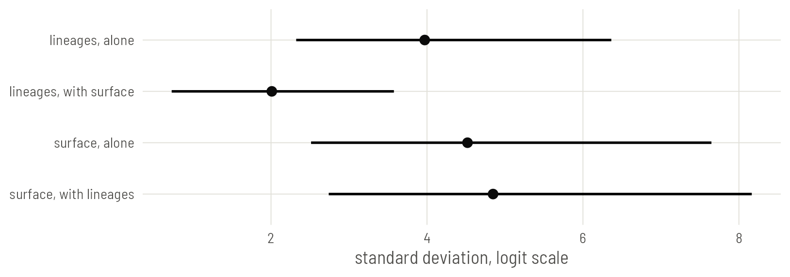

# Plate 5: Both at once

Put ancestry and geography in one model, see how they share the credit, and line up the elevation slope from every model so far.


## Set up

This plate needs everything the last three built: the phylogenetic matrix, the projected coordinates and the neighbour matrix.


``` r
library(ape)
library(brms)
library(sf)
library(spdep)
library(ggplot2)

base <- "https://rehan-muh.github.io/tutorials/data/"
d    <- read.csv(paste0(base, "languages.csv"))
tree <- read.tree(paste0(base, "glottolog_tree.nwk"))
d$elev_km <- d$elevation / 1000

A <- vcv(tree, corr = TRUE)                                   # Plate 2

pts <- st_as_sf(d, coords = c("lon", "lat"), crs = 4326)      # Plate 3
xy  <- st_coordinates(st_transform(pts, "+proj=eqearth")) / 1e6
d$x <- xy[, 1]
d$y <- xy[, 2]

coords <- as.matrix(d[, c("lon", "lat")])                     # Plate 4
W <- nb2mat(make.sym.nb(knn2nb(knearneigh(coords, k = 5, longlat = TRUE))),
            style = "B")
dimnames(W) <- list(d$glottocode, d$glottocode)

options(mc.cores = 4, brms.backend = "cmdstanr")
dir.create("fits", showWarnings = FALSE)
```

## Why one model and not two

Ancestry and geography are not separate facts about a language. Languages are born next to their relatives and mostly stay there. Measure it: take every pair of languages, and compare the distance between pairs in the same family with the distance between pairs in different families.


``` r
km   <- sp::spDists(coords, longlat = TRUE)
pair <- upper.tri(A)
same_family <- A > 0

round(c(same      = median(km[pair & same_family]),
        different = median(km[pair & !same_family])))
```

``` output
     same different 
     1665      9891 
```

Related languages are several times closer to each other than unrelated ones. So a cluster of ejective languages that are related *and* adjacent could be credited to the tree or to the map. A model with only one of them hands it all the credit. A model with both has to share it out, and reports honestly when it cannot.

## The joint model

Nothing new is needed. The formula takes the phylogenetic term from Plate 2 and the Gaussian process from Plate 3, and the priors are the ones used there.


``` r
priors <- prior(normal(0, 1), class = b) +
          prior(exponential(1), class = sd) +
          prior(exponential(1), class = sdgp)

m_joint <- brm(ejectives ~ elev_km +
                 (1 | gr(glottocode, cov = A)) +
                 gp(x, y, k = 20, c = 5/4),
               data = d, data2 = list(A = A),
               family = bernoulli(), prior = priors,
               control = list(adapt_delta = 0.95),
               seed = 1, file = "fits/m_joint")

summary(m_joint)
```

``` output
 Family: bernoulli 
  Links: mu = logit 
Formula: ejectives ~ elev_km + (1 | gr(glottocode, cov = A)) + gp(x, y, k = 20, c = 5/4) 
   Data: d (Number of observations: 500) 
  Draws: 4 chains, each with iter = 2000; warmup = 1000; thin = 1;
         total post-warmup draws = 4000

Gaussian Process Hyperparameters:
             Estimate Est.Error l-95% CI u-95% CI Rhat Bulk_ESS Tail_ESS
sdgp(gpxy)       4.85      1.37     2.74     8.16 1.00     1749     2319
lscale(gpxy)     0.07      0.02     0.03     0.12 1.00     1361     2156

Multilevel Hyperparameters:
~glottocode (Number of levels: 500) 
              Estimate Est.Error l-95% CI u-95% CI Rhat Bulk_ESS Tail_ESS
sd(Intercept)     2.01      0.72     0.73     3.58 1.01      833      966

Regression Coefficients:
          Estimate Est.Error l-95% CI u-95% CI Rhat Bulk_ESS Tail_ESS
Intercept    -5.29      1.59    -8.72    -2.44 1.00     2037     1931
elev_km       1.37      0.40     0.65     2.24 1.00     2845     2247

Draws were sampled using sample(hmc). For each parameter, Bulk_ESS
and Tail_ESS are effective sample size measures, and Rhat is the potential
scale reduction factor on split chains (at convergence, Rhat = 1).
```

## Bring back the earlier models

The next two sections compare the joint model with the single-source models. If you worked through Plates 2 to 4, their fits are in `fits/` and these calls load them at once. If not, they fit now, which takes about ten minutes.


``` r
m0 <- glm(ejectives ~ elev_km, family = binomial, data = d)

p_sd  <- prior(normal(0, 1), class = b) + prior(exponential(1), class = sd)
p_gp  <- prior(normal(0, 1), class = b) + prior(exponential(1), class = sdgp)
p_car <- prior(normal(0, 1), class = b) + prior(exponential(1), class = sdcar)

m_fam <- brm(ejectives ~ elev_km + (1 | family),
             data = d, family = bernoulli(), prior = p_sd,
             seed = 1, file = "fits/m_fam")
m_phy <- brm(ejectives ~ elev_km + (1 | gr(glottocode, cov = A)),
             data = d, data2 = list(A = A), family = bernoulli(), prior = p_sd,
             seed = 1, file = "fits/m_phy")
m_gp  <- brm(ejectives ~ elev_km + gp(x, y, k = 20, c = 5/4),
             data = d, family = bernoulli(), prior = p_gp,
             control = list(adapt_delta = 0.95),
             seed = 1, file = "fits/m_gp")
m_bym <- brm(ejectives ~ elev_km + car(W, gr = glottocode, type = "bym2"),
             data = d, data2 = list(W = W), family = bernoulli(), prior = p_car,
             seed = 1, file = "fits/m_bym")
```

## Who gets the credit

The joint model has two standard deviations: `sd(Intercept)` for the lineage effects and `sdgp` for the surface. Set each beside its value in the model where it had the field to itself.


``` r
sd_row <- function(m, par) {
  posterior_summary(m, variable = par)[, c("Estimate", "Q2.5", "Q97.5")]
}
credit <- as.data.frame(rbind(
  "lineages, alone"        = sd_row(m_phy,   "sd_glottocode__Intercept"),
  "lineages, with surface" = sd_row(m_joint, "sd_glottocode__Intercept"),
  "surface, alone"         = sd_row(m_gp,    "sdgp_gpxy"),
  "surface, with lineages" = sd_row(m_joint, "sdgp_gpxy")))
round(credit, 2)
```

``` output
                       Estimate Q2.5 Q97.5
lineages, alone            3.97 2.32  6.36
lineages, with surface     2.01 0.73  3.58
surface, alone             4.52 2.51  7.65
surface, with lineages     4.85 2.74  8.16
```


``` r
credit$term <- factor(rownames(credit), levels = rev(rownames(credit)))

ggplot(credit, aes(Estimate, term)) +
  geom_linerange(aes(xmin = Q2.5, xmax = Q97.5), linewidth = 0.8) +
  geom_point(size = 2.6) +
  labs(x = "standard deviation, logit scale", y = NULL)
```


{width=814 height=286 alt="Standard deviations of the lineage effects and of the spatial surface, alone and in the joint model, with 95% intervals. Adding the surface halves what the tree is asked to explain. Adding the tree leaves the surface where it was."}

Once the surface is in the model, it accounts for much of what the tree was explaining alone, and the tree keeps a smaller share for itself. The surface gives up nothing in return.

Do not read that as a finding that contact matters more than inheritance. The intervals are wide and the two sources overlap: a region full of related languages can be explained either way, and the surface, being the more flexible of the two, tends to get there first. That is what collinearity looks like in a posterior. It is not a defect of the model. The split between inheritance and contact is weakly identified by data like these, and a model that claimed a sharp split would be inventing it.

The slope is another matter. It does not need the split, only the sum.

## Every slope so far


``` r
fits <- list("family intercept" = m_fam, "phylogeny" = m_phy,
             "space: GP" = m_gp, "space: BYM2" = m_bym,
             "phylogeny + space" = m_joint)

naive  <- unname(c(coef(m0)[2], sqrt(vcov(m0)[2, 2]), confint.default(m0)[2, ]))
slopes <- t(sapply(fits, function(m) fixef(m)["elev_km", ]))
slopes <- as.data.frame(rbind("naive glm" = naive, slopes))
slopes$ratio <- slopes$Estimate / slopes$Est.Error
round(slopes, 2)
```

``` output
                  Estimate Est.Error Q2.5 Q97.5 ratio
naive glm             0.84      0.15 0.55  1.13  5.72
family intercept      1.29      0.31 0.70  1.91  4.15
phylogeny             1.49      0.42 0.73  2.39  3.52
space: GP             1.13      0.27 0.65  1.69  4.27
space: BYM2           1.17      0.37 0.52  1.97  3.15
phylogeny + space     1.37      0.40 0.65  2.24  3.45
```


``` r
kind_of <- function(model) {
  ifelse(grepl("+", model, fixed = TRUE), "both",
         ifelse(grepl("space", model), "space", "ancestry"))
}
hues <- c(naive = "grey45", ancestry = "#1BAF7A", space = "#2A78D6",
          both = "grey10")

slopes$model <- factor(rownames(slopes), levels = rev(rownames(slopes)))
slopes$kind  <- c("naive", kind_of(rownames(slopes)[-1]))

ggplot(slopes, aes(Estimate, model, colour = kind)) +
  geom_vline(xintercept = 0, linetype = "dashed", colour = "grey45") +
  geom_linerange(aes(xmin = Q2.5, xmax = Q97.5), linewidth = 0.8) +
  geom_point(size = 2.6) +
  scale_colour_manual(values = hues, guide = "none") +
  labs(x = "log-odds of ejectives per km of elevation", y = NULL)
```


{width=814 height=374 alt="The elevation slope under six models, with 95% intervals. Green marks models of ancestry, blue models of space, black the model with both. Every model that accounts for dependence gives a wider interval than the naive regression. None of the intervals reaches zero."}

Read the table in two passes.

**Across the rows, look at `ratio`,** the estimate divided by its error. The raw slopes are not on a common scale, for the reason given on Plate 2: the more variation a model assigns to lineages and regions, the larger its within-group slope. The ratio is free of that. It falls from 5.7 in the naive model to between 3.2 and 4.3 in the others. The naive regression claimed a good deal more certainty than any model that takes dependence into account.

**Down the rows, look at agreement.** Five models that make different assumptions about dependence give intervals that overlap heavily and all exclude zero. That agreement is worth more than any single fit.

## Every regression line so far

The table compares one number per model. The lines show the whole relationship. For each model, draw the regression line averaged over the sample, the version comparable with the naive line: keep each language's own latent effects, move all 500 languages to the same elevation, and take the share expected to have ejectives. Plate 2 builds this step by step.


``` r
x <- seq(0, 4.5, by = 0.1)

averaged <- function(m, label) {
  b      <- as_draws_df(m)$b_elev_km
  eta    <- posterior_linpred(m)            # draws by languages, logit scale
  at_sea <- eta - outer(b, d$elev_km)       # every language moved to 0 km
  p <- sapply(x, function(xi) rowMeans(plogis(at_sea + b * xi)))
  data.frame(elev_km = x, model = label, p = colMeans(p),
             lo = apply(p, 2, quantile, 0.025),
             hi = apply(p, 2, quantile, 0.975))
}
lines <- do.call(rbind, Map(averaged, fits, names(fits)))
lines$kind <- kind_of(lines$model)
lines$line <- lines$model

# a sixth panel with all five lines and no bands, for direct comparison
overlay <- transform(lines, model = "all five together", lo = NA, hi = NA)
lines   <- rbind(lines, overlay)
lines$model <- factor(lines$model, levels = c(names(fits), "all five together"))

naive <- data.frame(elev_km = x)
naive$p <- predict(m0, newdata = naive, type = "response")

ggplot(lines, aes(elev_km, p, group = line)) +
  geom_ribbon(aes(ymin = lo, ymax = hi, fill = kind), alpha = 0.18) +
  geom_line(aes(colour = kind), linewidth = 0.9) +
  geom_line(data = naive, aes(elev_km, p), inherit.aes = FALSE,
            linetype = "22", colour = "grey35") +
  scale_colour_manual(values = hues, aesthetics = c("colour", "fill"),
                      name = NULL) +
  facet_wrap(~model, nrow = 2) +
  labs(x = "elevation (km)", y = "probability of ejectives")
```


{width=814 height=572 alt="The regression line of each model, averaged over the sample, with a 95% band: ancestry models in green, spatial models in blue, the joint model in black. The dashed line in every panel is the naive regression. The last panel lays the five lines over one another."}

The five lines tell one story. In the lowlands every model agrees with the naive regression. Above about two kilometres every model leaves it and climbs more slowly, with a band that keeps widening. In the last panel the five lines stay close together, and all of them sit well below the dashed one at altitude. Whichever way dependence is modelled, the naive regression was too steep and too sure at exactly the elevations the hypothesis is about.

The probability that the slope is positive under the joint model:


``` r
hypothesis(m_joint, "elev_km > 0")
```

``` output
Hypothesis Tests for class b:
     Hypothesis Estimate Est.Error CI.Lower CI.Upper Evid.Ratio Post.Prob Star
1 (elev_km) > 0     1.37       0.4     0.77     2.07        Inf         1    *
---
'CI': 90%-CI for one-sided and 95%-CI for two-sided hypotheses.
'*': For one-sided hypotheses, the posterior probability exceeds 95%;
for two-sided hypotheses, the value tested against lies outside the 95%-CI.
Posterior probabilities of point hypotheses assume equal prior probabilities.
```

So, in this sample and with these controls, languages at higher elevations are more likely to have ejectives than their relatives and neighbours lower down. The evidence is there, and it is clearly weaker than it first looked. [Plate 8](../08-classical/) adds one dissenting estimate, from a model that treats inheritance differently.

## Which model to report

Report the joint model, and show the table. A reader who doubts your tree can look at the spatial rows; one who doubts your map can look at the phylogeny row.

::: {.callout .pitfall}
It is tempting to pick among these models with `loo()` or WAIC. Be careful. Every model here has one latent value per language, and leave-one-out estimates are unreliable in that setting: brms will warn about high Pareto k values, and the warning means what it says. These models answer one question under different assumptions. They are a sensitivity analysis, not a contest.
:::

::: {.callout .assume}
A joint model controls for dependence that follows the tree or the map. It does not make an observational association causal. Anything that varies with altitude within regions and lineages, such as who settled the highlands and when, is still in the slope.
:::

::: {.callout .yours}
For a count, change the family to `poisson()` or `negbinomial()`; for a continuous feature, `gaussian()`. The two dependence terms stay as they are. With a continuous outcome the slopes of different models are on one scale and can be compared directly.
:::

## What to carry forward

- The joint model is the sum of the parts you already know: `(1 | gr(glottocode, cov = A)) + gp(x, y, k = , c = 5/4)`.
- Expect ancestry and geography to trade off. Report the slope with confidence and the split with caution.
- A table of the same slope under several dependence structures is the most persuasive thing you can show a sceptical reader.

The remaining plates refit these models with other engines. [Plate 6](../06-inla/) does it in seconds with INLA.
