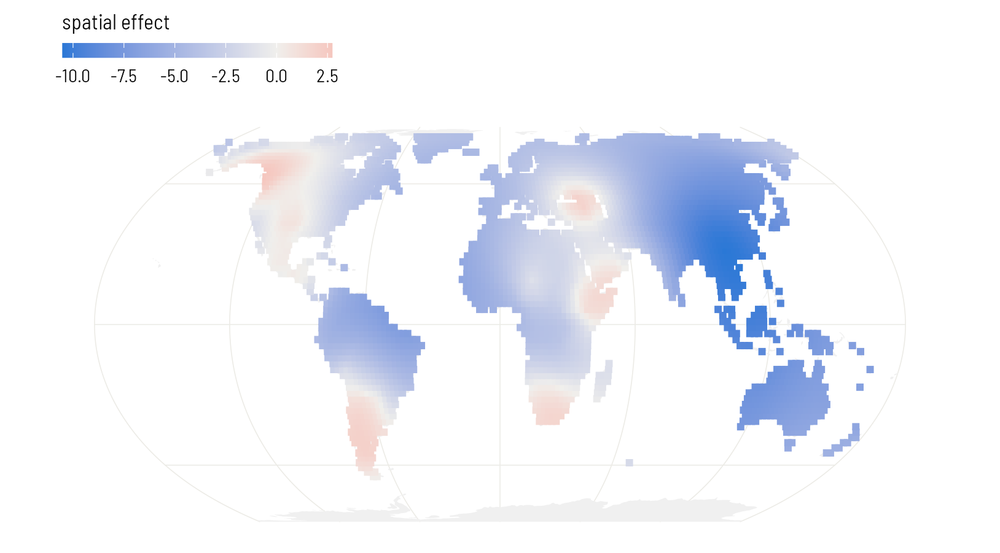
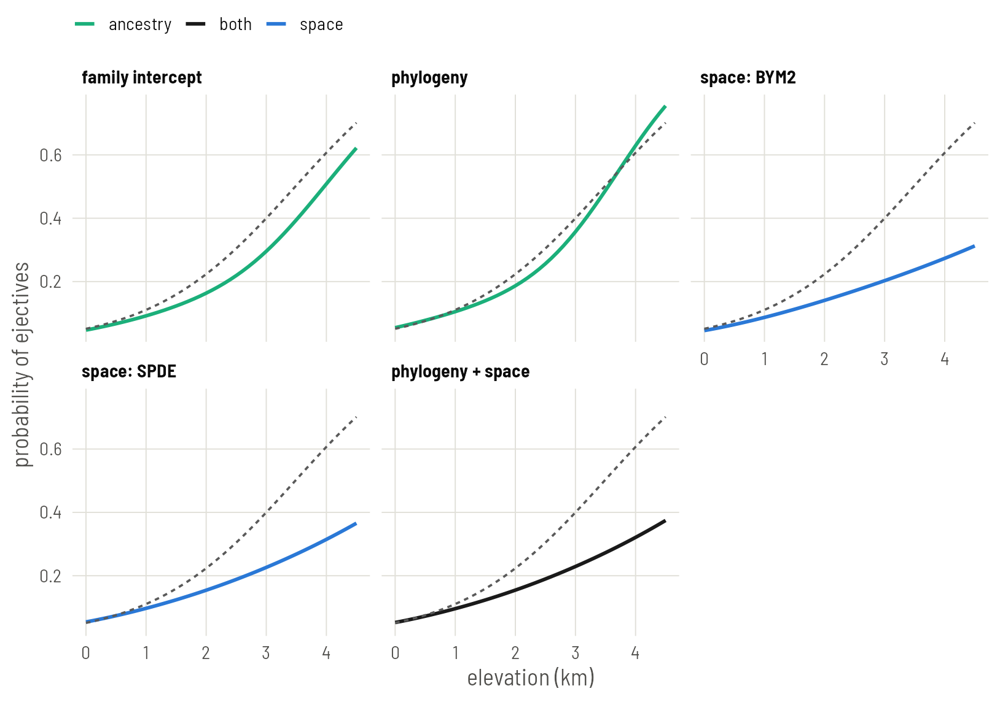

# Plate 6: The same models in INLA

Refit the family, phylogenetic, neighbour and joint models with INLA, which returns in seconds what Stan returns in minutes, and add a spatial surface that lives on the globe.


## Set up


``` r
library(INLA)
library(fmesher)
library(ape)
library(spdep)
library(sf)
library(rnaturalearth)
library(ggplot2)

base <- "https://rehan-muh.github.io/tutorials/data/"
d    <- read.csv(paste0(base, "languages.csv"))
tree <- read.tree(paste0(base, "glottolog_tree.nwk"))
d$elev_km <- d$elevation / 1000
```

## How INLA differs

brms draws samples from the posterior. INLA computes an approximation to it directly, using the fact that all the models in this series share one shape: a regression with Gaussian latent effects. For that class the approximation is accurate and takes seconds. The price is a formula interface with its own vocabulary:

- A latent effect is written `f(index, model = "...")`, where `index` is a column of integers saying which effect each row uses.
- INLA thinks in **precisions**, one over the variance, and in **precision matrices**, the inverse of covariance matrices.
- Priors are attached to each `f()` through `hyper =`.

So the first step is to give each language the integer indices the models will need.


``` r
d$fam_id <- as.integer(factor(d$family))
d$phy_id <- seq_len(nrow(d))        # row i of the phylogenetic matrix
d$sp_id  <- seq_len(nrow(d))        # row i of the neighbour matrix
```

## Matching the priors

To compare with the brms plates, use the same priors. There, every standard deviation had an exponential(1) prior, which puts 5% of its mass above 3. INLA's penalised-complexity prior `pc.prec` is that same exponential distribution on the standard deviation, specified by exactly that statement: `param = c(3, 0.05)` reads "the probability that the standard deviation exceeds 3 is 0.05". The slope prior, normal(0, 1), goes in `control.fixed`.


``` r
pc_sd <- list(prec = list(prior = "pc.prec", param = c(3, 0.05)))
fixed <- list(mean = 0, prec = 1)
```

INLA reports precisions. This helper converts a precision's posterior into a summary of the standard deviation, so the output can be read against the earlier plates.


``` r
sd_of <- function(fit, name) {
  m <- inla.tmarginal(function(p) 1 / sqrt(p), fit$marginals.hyperpar[[name]])
  z <- inla.zmarginal(m, silent = TRUE)
  round(c(mean = z$mean, lower = z$quant0.025, upper = z$quant0.975), 2)
}
slope_of <- function(fit) {
  cols <- c("mean", "sd", "0.025quant", "0.975quant")
  round(unlist(fit$summary.fixed["elev_km", cols]), 2)
}
```

## Family intercepts

The counterpart of `(1 | family)` is an `iid` effect.


``` r
i_fam <- inla(ejectives ~ elev_km + f(fam_id, model = "iid", hyper = pc_sd),
              family = "binomial", data = d, control.fixed = fixed)

slope_of(i_fam)
```

``` output
      mean         sd 0.025quant 0.975quant 
      1.36       0.31       0.79       2.00 
```

``` r
sd_of(i_fam, "Precision for fam_id")
```

``` output
 mean lower upper 
 3.76  2.36  5.64 
```

Compare Plate 2, where brms gave a slope of 1.29 with an error of 0.31 for the same model. The two engines agree closely.

## Phylogeny

The counterpart of `gr(glottocode, cov = A)` is a `generic0` effect. It wants the precision matrix, so invert the phylogenetic correlation matrix once. `phy_id` already follows the order of the data, so reorder `A` to match before inverting.


``` r
A <- vcv(tree, corr = TRUE)[d$glottocode, d$glottocode]
Q <- solve(A)

i_phy <- inla(ejectives ~ elev_km +
                f(phy_id, model = "generic0", Cmatrix = Q, hyper = pc_sd),
              family = "binomial", data = d, control.fixed = fixed)

slope_of(i_phy)
```

``` output
      mean         sd 0.025quant 0.975quant 
      1.45       0.40       0.78       2.38 
```

``` r
sd_of(i_phy, "Precision for phy_id")
```

``` output
 mean lower upper 
 3.00  1.75  4.58 
```

::: {.callout .yours}
`solve()` on a dense matrix is fine up to a few thousand languages. The one thing to get right is the order: row `i` of `Q` must be the language whose `phy_id` is `i`. Indexing `A` by the data's language column, as above, guarantees it.
:::

## Neighbours: BYM2

Build the same five-nearest-neighbour graph as on Plate 4. INLA takes the 0/1 matrix as its `graph`.


``` r
coords <- as.matrix(d[, c("lon", "lat")])
nb <- make.sym.nb(knn2nb(knearneigh(coords, k = 5, longlat = TRUE)))
W  <- nb2mat(nb, style = "B")

pc_bym <- list(prec = list(prior = "pc.prec", param = c(3, 0.05)),
               phi  = list(prior = "pc", param = c(0.5, 0.5)))

i_bym <- inla(ejectives ~ elev_km +
                f(sp_id, model = "bym2", graph = W, scale.model = TRUE,
                  hyper = pc_bym),
              family = "binomial", data = d, control.fixed = fixed)

slope_of(i_bym)
```

``` output
      mean         sd 0.025quant 0.975quant 
      2.99       1.47       0.58       5.54 
```

``` r
sd_of(i_bym, "Precision for sp_id")
```

``` output
 mean lower upper 
 4.71  3.01  7.06 
```

``` r
ci <- c("mean", "0.025quant", "0.975quant")
round(i_bym$summary.hyperpar["Phi for sp_id", ci], 2)
```

``` output
              mean 0.025quant 0.975quant
Phi for sp_id 0.98        0.9          1
```

`Phi` is the spatial share that brms called `rhocar`. Its prior here says it is as likely to be above one half as below.

Now look at the slope. On Plate 4, brms gave about 1.2 for this model, with the same data, the same graph and the same priors. INLA's answer is more than twice that, with an interval several times wider. One of the two is wrong. Hold that thought; the section on checking the approximation, below, settles it.

## A surface on the sphere: SPDE

Plate 3 drew its surface on a flat map. INLA's stochastic partial differential equation (SPDE) approach builds a Gaussian process on a mesh of triangles, and the mesh can cover the globe. There is no projection and no edge.

It takes four steps.

**1. Put the languages on the unit sphere.**


``` r
to_sphere <- function(lon, lat) {
  rad <- pi / 180
  cbind(cos(lat * rad) * cos(lon * rad),
        cos(lat * rad) * sin(lon * rad),
        sin(lat * rad))
}
xyz <- to_sphere(d$lon, d$lat)
```

**2. Build the mesh.** `globe = 12` divides the sphere into triangles with sides of roughly 600 km. The surface is free to vary between mesh nodes, so the triangles should be clearly smaller than the distances over which you expect it to change.


``` r
mesh <- fm_rcdt_2d(globe = 12)
mesh$n
```

``` output
[1] 1442
```

**3. Define the surface and its priors.** Distances on the unit sphere are in radians; one radian is about 6,370 km. The priors say that the range, the distance at which correlation has nearly died out, is unlikely to be below 0.05 radians (about 300 km), and that the standard deviation is unlikely to exceed 3, as everywhere else.


``` r
spde <- inla.spde2.pcmatern(mesh,
                            prior.range = c(0.05, 0.05),
                            prior.sigma = c(3, 0.05))
```

**4. Connect languages to the mesh and fit.** A language rarely sits on a mesh node, so its value is interpolated from the three corners of its triangle. `fm_basis()` computes those weights, and `inla.stack()` bundles them with the data. This is the one piece of bookkeeping the SPDE approach demands.


``` r
loc_weights <- fm_basis(mesh, loc = xyz)

stack <- inla.stack(
  data    = list(y = d$ejectives),
  A       = list(loc_weights, 1),
  effects = list(field = seq_len(mesh$n),
                 data.frame(intercept = 1, elev_km = d$elev_km,
                            phy_id = d$phy_id)))

i_spde <- inla(y ~ 0 + intercept + elev_km + f(field, model = spde),
               family = "binomial", data = inla.stack.data(stack),
               control.predictor = list(A = inla.stack.A(stack)),
               control.fixed = fixed)

slope_of(i_spde)
```

``` output
      mean         sd 0.025quant 0.975quant 
      1.09       0.32       0.48       1.73 
```

``` r
round(i_spde$summary.hyperpar[, ci], 2)
```

``` output
                mean 0.025quant 0.975quant
Range for field 1.15       0.63       1.91
Stdev for field 4.97       2.87       7.95
```


The estimated range is about 7,300 km. The range of a Matérn surface is the distance at which correlation has fallen to roughly 0.1, so it is always a larger number than the length-scale brms reported on Plate 3, by a factor of about two. The two fits describe surfaces of similar reach: wide regional swells, with the sample's whole eastern half sitting low.

Because the surface is defined everywhere on the mesh, it can be evaluated anywhere, not only where there are languages. Evaluate it on a grid of land points and draw the map.


``` r
world <- ne_countries(scale = "small", returnclass = "sf")
sf_use_s2(FALSE)

grid <- expand.grid(lon = seq(-179, 179, 2), lat = seq(-55, 75, 2))
grid <- st_as_sf(grid, coords = c("lon", "lat"), crs = 4326, remove = FALSE)
grid <- grid[lengths(st_intersects(grid, world)) > 0, ]

grid$field <- as.vector(fm_basis(mesh, loc = to_sphere(grid$lon, grid$lat)) %*%
                          i_spde$summary.random$field$mean)

ggplot() +
  geom_sf(data = world, fill = "grey94", colour = NA) +
  geom_sf(data = grid, aes(colour = field), size = 1.5, shape = 15) +
  scale_colour_gradient2(low = "#2A78D6", mid = "#F0EFEC", high = "#E34948",
                         name = "spatial effect") +
  coord_sf(crs = "+proj=eqearth")
```


{width=814 height=451 alt="Posterior mean of the SPDE surface on land, on the logit scale. Red regions favour ejectives beyond what elevation predicts; blue regions disfavour them."}

## Phylogeny and space together

The joint model adds the phylogenetic `generic0` term to the SPDE model. The stack already carries `phy_id`, so only the formula changes.


``` r
i_joint <- inla(y ~ 0 + intercept + elev_km + f(field, model = spde) +
                  f(phy_id, model = "generic0", Cmatrix = Q, hyper = pc_sd),
                family = "binomial", data = inla.stack.data(stack),
                control.predictor = list(A = inla.stack.A(stack)),
                control.fixed = fixed)

slope_of(i_joint)
```

``` output
      mean         sd 0.025quant 0.975quant 
      1.18       0.35       0.52       1.91 
```

``` r
sd_of(i_joint, "Precision for phy_id")
```

``` output
 mean lower upper 
 0.80  0.15  1.97 
```

``` r
round(i_joint$summary.hyperpar[c("Range for field", "Stdev for field"), ci], 2)
```

``` output
                mean 0.025quant 0.975quant
Range for field 1.21       0.67       2.00
Stdev for field 5.13       2.98       8.13
```

## Check the approximation

INLA does not sample. It approximates, and an approximation can fail without an error message. Binary data with one latent value per language, which is our case, is where it is under the most strain.

There is a cheap test. INLA has two computational modes: the current default, which is fast and applies a variational correction, and an older one called `classic`, which is slower and built differently. When the two agree, the answer is very likely sound. When they disagree, at least one is wrong.

Every INLA fit stores the arguments it was called with in `.args`, so all five models can be refitted in classic mode without retyping them.


``` r
fits <- list("family intercept" = i_fam, "phylogeny" = i_phy,
             "space: BYM2" = i_bym, "space: SPDE" = i_spde,
             "phylogeny + space" = i_joint)

classic <- lapply(fits, function(fit) {
  args <- fit$.args
  args$inla.mode <- "classic"
  do.call(inla, args)
})

data.frame(default = sapply(fits, function(f) slope_of(f)[["mean"]]),
           classic = sapply(classic, function(f) slope_of(f)[["mean"]]))
```

``` output
                  default classic
family intercept     1.36    1.34
phylogeny            1.45    1.47
space: BYM2          2.99    1.13
space: SPDE          1.09    1.03
phylogeny + space    1.18    1.13
```

Four of the five models give the same slope either way. BYM2 does not. In classic mode its slope matches the brms fit from Plate 4; in the default mode it is far off. So for this model, with these data, the default approximation failed, and nothing in the output said so.

::: {.callout .pitfall}
Make this comparison a habit for any INLA model with a binary outcome, and keep one brms fit of your final model as a reference. If the modes disagree, report the one a sampler confirms, and say that you checked.
:::

## All five, and what they cost

Use the classic fit for BYM2 and the default fits for the rest.


``` r
fits[["space: BYM2"]] <- classic[["space: BYM2"]]

out <- as.data.frame(t(sapply(fits, slope_of)))
out$seconds <- round(sapply(fits, function(f) f$cpu.used[["Total"]]), 1)
out
```

``` output
                  mean   sd 0.025quant 0.975quant seconds
family intercept  1.36 0.31       0.79       2.00     5.4
phylogeny         1.45 0.40       0.78       2.38     4.4
space: BYM2       1.13 0.32       0.56       1.80    29.4
space: SPDE       1.09 0.32       0.48       1.73    17.2
phylogeny + space 1.18 0.35       0.52       1.91    17.1
```

And the regression lines. As on Plate 5, each line is averaged over the sample so that it can be compared with the naive regression: every language keeps its own latent effects and all are moved to the same elevation. INLA stores the posterior mean of each language's linear predictor, so these are lines without bands. For bands, fit with `control.compute = list(config = TRUE)` and draw from `inla.posterior.sample()`.


``` r
x  <- seq(0, 4.5, by = 0.1)
m0 <- glm(ejectives ~ elev_km, family = binomial, data = d)

line_of <- function(fit, label) {
  eta    <- fit$summary.linear.predictor$mean[seq_len(nrow(d))]
  b      <- fit$summary.fixed["elev_km", "mean"]
  at_sea <- eta - b * d$elev_km           # every language moved to 0 km
  data.frame(elev_km = x, model = label,
             p = sapply(x, function(xi) mean(plogis(at_sea + b * xi))))
}
lines <- do.call(rbind, Map(line_of, fits, names(fits)))
lines$model <- factor(lines$model, levels = names(fits))

kind_of <- function(model) {
  ifelse(grepl("+", model, fixed = TRUE), "both",
         ifelse(grepl("space", model), "space", "ancestry"))
}
hues <- c(naive = "grey45", ancestry = "#1BAF7A", space = "#2A78D6",
          both = "grey10")
lines$kind <- kind_of(lines$model)

naive <- data.frame(elev_km = x)
naive$p <- predict(m0, newdata = naive, type = "response")

ggplot(lines, aes(elev_km, p)) +
  geom_line(aes(colour = kind), linewidth = 0.9) +
  geom_line(data = naive, linetype = "22", colour = "grey35") +
  scale_colour_manual(values = hues, name = NULL) +
  facet_wrap(~model, nrow = 2) +
  labs(x = "elevation (km)", y = "probability of ejectives")
```


{width=814 height=572 alt="The regression line of each INLA model, averaged over the sample and computed at posterior means. The dashed line is the naive regression. Compare the brms panels on Plate 5."}

Set this beside the table on Plate 5. The slopes agree with the brms fits, model for model, and the whole table took less time than one Stan compilation.

::: {.callout .assume}
The SPDE surface is a Matérn field, a rougher relative of the default surface in brms. Its smoothness is fixed by the method; the range and standard deviation are estimated.
:::

## What to carry forward

- Every model from Plates 2 to 5 has an INLA counterpart: `iid`, `generic0` with the inverse of the phylogenetic matrix, `bym2` with the neighbour matrix, and an SPDE surface.
- `pc.prec` with `param = c(3, 0.05)` is the exponential(1) prior of the brms plates.
- Refit in `classic` mode and compare. It caught a failure here that would otherwise have gone into a table.
- The SPDE mesh on the sphere is the cleanest way in this series to treat a world sample as what it is.

When you need to try twenty specifications, INLA is the tool. [Plate 7](../07-mgcv/) covers another fast engine with a different philosophy: everything is a penalised smooth.
