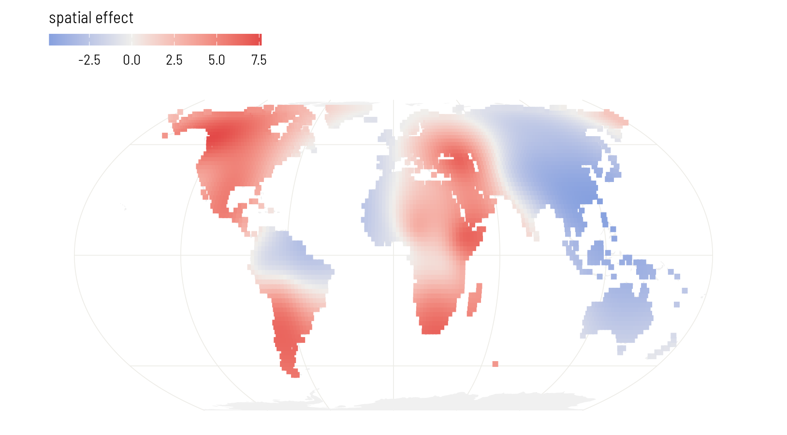
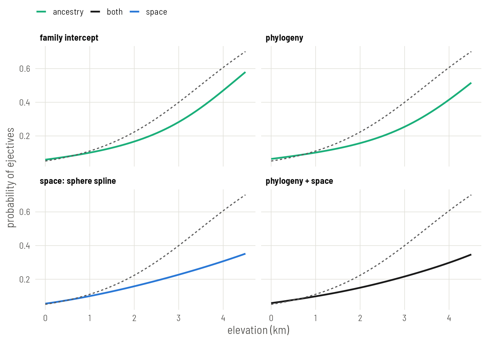

# Plate 7: The same models as a GAM

In mgcv a family intercept, a phylogenetic effect and a spatial surface are all the same object, a penalised smooth, and a model with all three fits in seconds without priors.


## Set up

mgcv identifies groups by factor levels, so the family and language columns become factors. The language factor takes its level order from the tree, which will matter below.


``` r
library(mgcv)
library(ape)
library(sf)
library(rnaturalearth)
library(ggplot2)

base <- "https://rehan-muh.github.io/tutorials/data/"
d    <- read.csv(paste0(base, "languages.csv"))
tree <- read.tree(paste0(base, "glottolog_tree.nwk"))
d$elev_km <- d$elevation / 1000

d$family     <- factor(d$family)
d$glottocode <- factor(d$glottocode, levels = tree$tip.label)
```

## How a GAM sees dependence

A generalised additive model adds smooth terms to a regression. Each smooth is a set of coefficients with a penalty that discourages some patterns among them. Choose the penalty and you choose the kind of dependence:

- Penalise each coefficient's distance from zero, and you have a random intercept.
- Penalise differences between coefficients according to a tree, and you have a phylogenetic effect.
- Penalise the wiggliness of a surface, and you have a spatial smooth.

mgcv estimates the strength of each penalty from the data by restricted maximum likelihood (REML). There are no priors to set and nothing to sample, which is why it is fast. It is also why it has less to say about uncertainty in the variance components than brms or INLA do.

## Family intercepts

`bs = "re"` is the random-effect smooth.


``` r
g_fam <- gam(ejectives ~ elev_km + s(family, bs = "re"),
             family = binomial, data = d, method = "REML")

summary(g_fam)$p.table
```

``` output
            Estimate Std. Error z value Pr(>|z|)
(Intercept)    -3.43      0.655   -5.24 1.58e-07
elev_km         1.16      0.309    3.77 1.60e-04
```

``` r
gam.vcomp(g_fam)
```

``` output

Standard deviations and 0.95 confidence intervals:

          std.dev lower upper
s(family)    4.51   2.8  7.28

Rank: 1/1

All smooth components:
[1] 4.51
```

`gam.vcomp()` reports the penalty as a standard deviation, the counterpart of `sd(Intercept)` in brms.

## Phylogeny as a Markov random field

`bs = "mrf"` is a smooth over the levels of a factor whose penalty you supply as a matrix. Give it the inverse of the phylogenetic correlation matrix and it becomes a phylogenetic random effect: the same model as `gr(glottocode, cov = A)` on Plate 2.

The penalty matrix needs row and column names that match the factor levels. That is why the factor was built from `tree$tip.label`.


``` r
A <- vcv(tree, corr = TRUE)
Q <- solve(A)
dimnames(Q) <- dimnames(A)

g_phy <- gam(ejectives ~ elev_km +
               s(glottocode, bs = "mrf", xt = list(penalty = Q)),
             family = binomial, data = d, method = "REML")

summary(g_phy)$p.table
```

``` output
            Estimate Std. Error z value Pr(>|z|)
(Intercept)    -4.05      0.435   -9.32 1.20e-20
elev_km         0.97      0.358    2.71 6.69e-03
```

``` r
gam.vcomp(g_phy)
```

``` output

Standard deviations and 0.95 confidence intervals:

              std.dev lower upper
s(glottocode)    3.85  2.31  6.44

Rank: 1/1

All smooth components:
[1] 3.85
```

::: {.callout .pitfall}
The `mrf` smooth takes an argument `k` that keeps only the `k` smoothest patterns on the tree. It is tempting for speed, and for a phylogeny it is risky: the patterns it drops first are the ones that separate small families and close sisters, which is most of what a language tree contains. Leave `k` out, as above, to keep the full matrix. With 500 languages that still fits in a few seconds.
:::

## Space as a spline on the sphere

`bs = "sos"` is a spline on the sphere. It takes latitude and longitude in degrees, in that order, and measures distance along the globe. No projection is needed.


``` r
g_sos <- gam(ejectives ~ elev_km + s(lat, lon, bs = "sos", k = 60),
             family = binomial, data = d, method = "REML")

summary(g_sos)$p.table
```

``` output
            Estimate Std. Error z value Pr(>|z|)
(Intercept)    -6.22      1.676   -3.71 0.000208
elev_km         1.10      0.352    3.14 0.001705
```

``` r
summary(g_sos)$s.table
```

``` output
            edf Ref.df Chi.sq p-value
s(lat,lon) 23.4     59   69.1       0
```

`k = 60` is the largest number of building blocks the surface may use; the penalty then decides how many it effectively needs, reported as `edf`. If `edf` comes out close to `k`, the surface wanted more room: raise `k` and refit. `k.check()` runs a formal version of that test.


``` r
k.check(g_sos)
```

``` output
           k'  edf k-index p-value
s(lat,lon) 59 23.4       1    0.62
```

A fitted smooth can be evaluated anywhere. As on Plate 6, predict it on a grid of land points. `type = "terms"` returns the contribution of each term separately, so the surface can be drawn without the intercept or elevation.


``` r
world <- ne_countries(scale = "small", returnclass = "sf")
sf_use_s2(FALSE)

grid <- expand.grid(lon = seq(-179, 179, 2), lat = seq(-55, 75, 2), elev_km = 0)
grid <- st_as_sf(grid, coords = c("lon", "lat"), crs = 4326, remove = FALSE)
grid <- grid[lengths(st_intersects(grid, world)) > 0, ]

grid$surface <- predict(g_sos, newdata = grid, type = "terms",
                        terms = "s(lat,lon)")[, 1]

ggplot() +
  geom_sf(data = world, fill = "grey94", colour = NA) +
  geom_sf(data = grid, aes(colour = surface), size = 1.5, shape = 15) +
  scale_colour_gradient2(low = "#2A78D6", mid = "#F0EFEC", high = "#E34948",
                         name = "spatial effect") +
  coord_sf(crs = "+proj=eqearth")
```


{width=814 height=451 alt="The spline-on-the-sphere surface on land, on the logit scale. It finds the same regions as the surfaces on Plates 3 and 6."}

## Phylogeny and space together

Add the two smooths.


``` r
g_joint <- gam(ejectives ~ elev_km +
                 s(glottocode, bs = "mrf", xt = list(penalty = Q)) +
                 s(lat, lon, bs = "sos", k = 60),
               family = binomial, data = d, method = "REML")

summary(g_joint)$p.table
```

``` output
            Estimate Std. Error z value Pr(>|z|)
(Intercept)    -6.75      1.987   -3.40 0.000686
elev_km         1.26      0.507    2.49 0.012759
```

``` r
summary(g_joint)$s.table
```

``` output
               edf Ref.df Chi.sq p-value
s(glottocode) 34.7    498   38.1  0.1414
s(lat,lon)    21.9     59   44.5  0.0257
```

The `edf` column is the GAM's version of the trade-off on Plate 5. It says how much of each term's flexibility the fit ended up using once the other was present.

## All four


``` r
fits <- list("family intercept" = g_fam, "phylogeny" = g_phy,
             "space: sphere spline" = g_sos, "phylogeny + space" = g_joint)

round(t(sapply(fits, function(g) summary(g)$p.table["elev_km", 1:3])), 2)
```

``` output
                     Estimate Std. Error z value
family intercept         1.16       0.31    3.77
phylogeny                0.97       0.36    2.71
space: sphere spline     1.10       0.35    3.14
phylogeny + space        1.26       0.51    2.49
```

The regression lines. As on Plates 5 and 6, each is averaged over the sample: every language keeps its own fitted smooths and all are moved to the same elevation. `predict()` returns each language's linear predictor, smooths included.


``` r
x  <- seq(0, 4.5, by = 0.1)
m0 <- glm(ejectives ~ elev_km, family = binomial, data = d)

line_of <- function(g, label) {
  b      <- coef(g)[["elev_km"]]
  at_sea <- predict(g) - b * d$elev_km    # every language moved to 0 km
  data.frame(elev_km = x, model = label,
             p = sapply(x, function(xi) mean(plogis(at_sea + b * xi))))
}
lines <- do.call(rbind, Map(line_of, fits, names(fits)))
lines$model <- factor(lines$model, levels = names(fits))

kind_of <- function(model) {
  ifelse(grepl("+", model, fixed = TRUE), "both",
         ifelse(grepl("space", model), "space", "ancestry"))
}
hues <- c(naive = "grey45", ancestry = "#1BAF7A", space = "#2A78D6",
          both = "grey10")
lines$kind <- kind_of(lines$model)

naive <- data.frame(elev_km = x)
naive$p <- predict(m0, newdata = naive, type = "response")

ggplot(lines, aes(elev_km, p)) +
  geom_line(aes(colour = kind), linewidth = 0.9) +
  geom_line(data = naive, linetype = "22", colour = "grey35") +
  scale_colour_manual(values = hues, name = NULL) +
  facet_wrap(~model, nrow = 2) +
  labs(x = "elevation (km)", y = "probability of ejectives")
```


{width=814 height=572 alt="The regression line of each GAM, averaged over the sample. The dashed line is the naive regression. Compare the brms panels on Plate 5 and the INLA panels on Plate 6."}

::: {.callout .assume}
These standard errors treat the estimated penalties as known. That makes them a little too small. `vcov(g_joint, unconditional = TRUE)` returns a covariance matrix corrected for it; take the square root of its `elev_km` diagonal entry if you want the more careful number.
:::


``` r
round(sqrt(diag(vcov(g_joint, unconditional = TRUE))["elev_km"]), 2)
```

``` output
elev_km 
   0.58 
```

::: {.callout .yours}
For tens of thousands of rows, replace `gam()` with `bam()` and add `discrete = TRUE`; the formula does not change. For a neighbour graph in place of a tree, `bs = "mrf"` with `xt = list(nb = ...)` takes a named list of neighbours and fits an ICAR-type smooth, the mgcv counterpart of Plate 4.
:::

## What to carry forward

- `s(family, bs = "re")`, `s(glottocode, bs = "mrf", xt = list(penalty = Q))` and `s(lat, lon, bs = "sos")` are the three terms. They add.
- A GAM gives a fast, prior-free answer and good maps. Its account of uncertainty in the variance components is thinner than a Bayesian fit's.
- Set this plate beside Plates 5 and 6. Three engines with different machinery put the slope between about 1.0 and 1.5, with errors of 0.3 to 0.5. That agreement is the point.

[Plate 8](../08-classical/) closes the series with the oldest tools for the same job.
